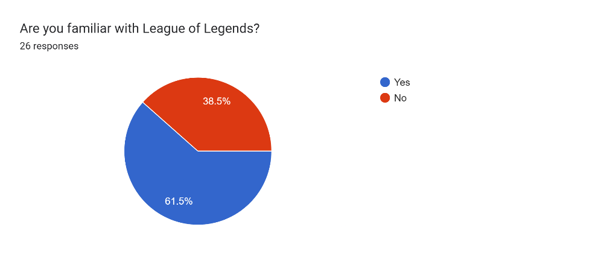
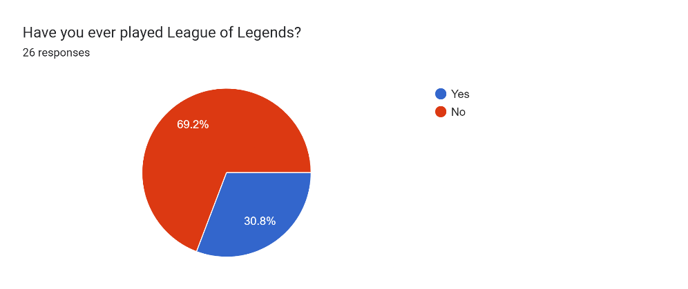
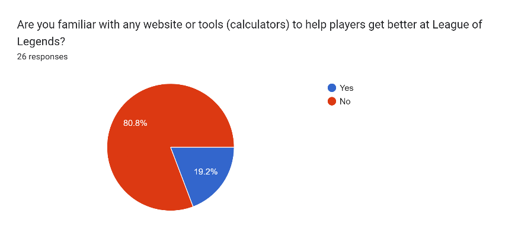
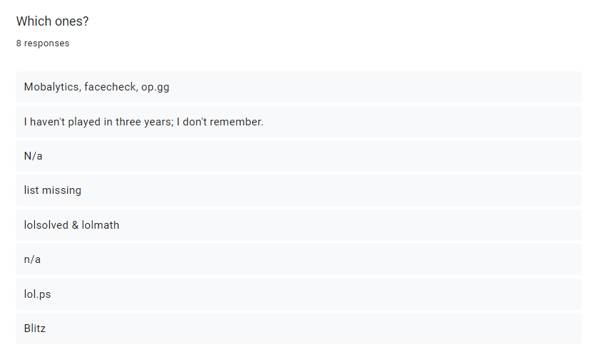
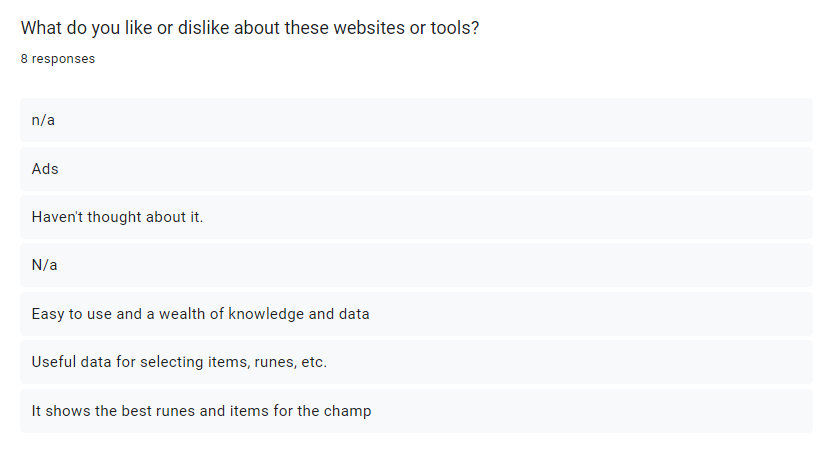
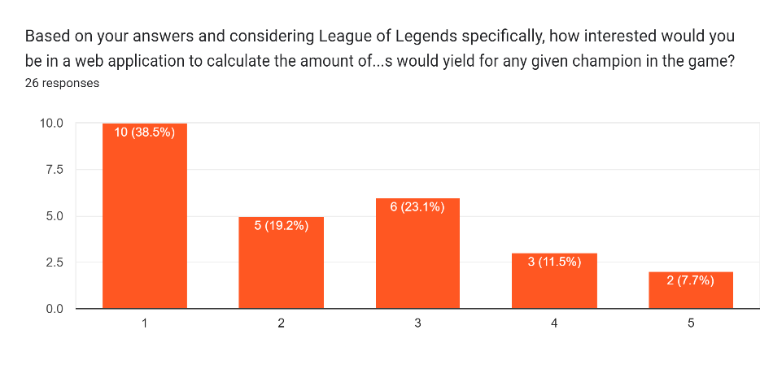
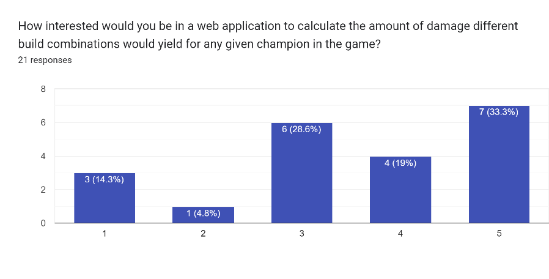
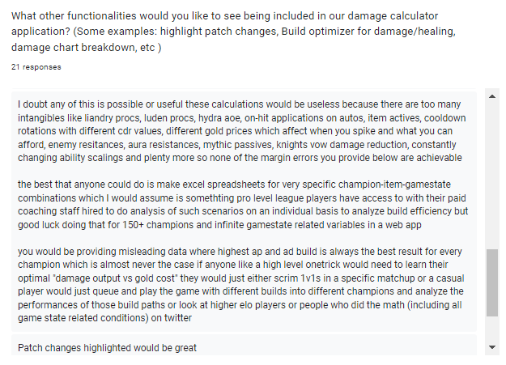

# Aims, Objectives, Requirements

## Aims

After carefully considering the idea for our proposal, our main aim is to create a tool that will help experienced League of Legends players in their strategy planning for level of damage under specific circumstances, as well as making the use of the system simple, understandable, and as straightforward as possible.

Furthermore, our main aim is divided into smaller, more specific aims which coincide with the steps we decided to take to approach the project; at the same time, these aims are divided into particular objectives described as bullet points as follows:

[Aim]{.underline}: Provide a detailed plan for the calculator tool project

-   Research and choose the most appropriate project management tools for our team

-   Define the scope of the project

-   Decide on the research approach and how to execute it

[Aim]{.underline}: Choose the requirements and specifications based on the research we have performed

-   Create a survey to get qualitative feedback on the subject of the League of Legends game itself and people's experiences with it

-   Carry out robust market research to identify the target userbase

-   Analyze existing tools which provide similar functionality to what we are looking to achieve

[Aim]{.underline}: Provide low and mid fidelity prototypes of our web application

-   Create several web application prototype models that showcase the functionality we are trying to achieve on a couple of different layouts

-   Feed the previously mentioned prototypes to a focus group of experienced players of the game through a survey and obtain feedback on the layouts presented

-   Discuss on the different ways these prototypes can be improved

## Requirements elicitation { style="page-break-before:always;"}

Due   to   how   thoroughly   we   had   discussed   the   project   idea   from   the   beginning   of   our   team meetings, we already had a rough idea of the basic functionalities we wanted our application to have. This was due in part to one of our team members being a recurrent player of League of Legends.   As   such,   we   started   with   quite   a   good   base   of   requirement   ideas.   Nevertheless, because one of our goals is to create a tool for other players, we believed feedback for our list of requirements from outside sources would beat least partially required.

Our initial expectations for the application’s requirements included:
- being able to choose any champion (character) and any target (enemy) 
- pick any equipment and items
- display the damage calculations using the given above information
- have a clean, understandable and intuitive user interface which will avoid users getting confused while using it as much as possible

A   couple   of   additional   ideas   we   contemplated   are   the   customization   of   target   stats   and   the addition of more champions and equipment/items; these ideas will be considered further once the application’s development is at a more advanced stage.  

Furthermore,   we   pondered   over   some   of   the   functionality   for   the   optimization   section   of   the
project, which would mainly work as a way to calculate the maximum damage possible for any
given circumstance. We will keep to the damage calculation section specifically for this report.

Our   first   approach   to   gathering   information   involved   creating   a   questionnaire   with   several questions about people’s general knowledge of League of Legends and other online multiplayer videogames. This questionnaire was directed at the general public, without particular focus on any target users. The survey, which was created using the Google Forms platform, was sent to the University of London’s official Slack workspace to be filled out by other students of the BSc in Computer Science degree.

{ width=80% height=80% }

{width=80% height=80%}

The goal of this first survey was to get a general idea of what people knew about the game and the existing tools to aid its users, as well as acquiring information on similar games and their respective tools of the same nature. This would serve as a reference point, as we would use the data to compare the strengths and weaknesses of existing tools in the context of the respective games they are created for, and figure out how we could use that knowledge and translate it onto our application.

{width=70% height=70%}

{width=70% height=70%}

We realized fairly quickly, however, that the results from this first survey were not as or helpful as we had hoped. We were missing more specific responses that would help us understand more explicitly and unambiguously the types of features that would be expected for such a calculator tool. Additionally, we found that without a focus group of users that could potentially be interested in our application, the general interest for it was not present as much.

We   decided   to   create   a different   questionnaire   based on   the   first   one,   and   added more   experienced   user- specific   questions,   such   as asking   for   current   in-game rank, the level of interest for a calculator   tool,   and   an   open- ended   question   about   the functionalities   that   users  would  be  interested   in   seeing   included   in   the   application.   This new survey was sent out to a chosen focus group of people who are regular players of the game.

This time, the open-ended responses were a lot more thorough. However, we noticed we had a slightly different problem; the experienced users’ feedback was overly detailed. Our reasoning for this outcome was that the open-ended questions were left too open, and as such, the users described functionalities far more particular than the simple ones we had in mind at the moment.

Mulling over our options, we ultimately decided that while we appreciated all the data we had gathered,   the   detailed   feedback   we   got   could   not   realistically   be   reduced   enough   into achievable requirements at this stage. These ideas seemed to be based on the assumption that there was already a working model of our application that  could be further  enhanced, rather than helping us pin down the most basic functionality for an application still in its early stages. With the above in mind, we chose to keep to the initial list we had already constructed of more attainable   requirements.   We   could   still,   however,   consider   the   above   data   at   a   later   stage, where they might become more manageable in the scope of our project.

## Approach and motivations

The main approach that we use is User-Centred Design. We understand the importance of iterative design process and therefore we created the focus group and involved them in each stage of the design process. We did the requirements elicitation by sending the surveys and also got feedback about wireframes designs. We are planning on sending more surveys to our focus group on the subject of colour palette, choosing the better version of our working web app and its usability features.

The most significant goal of this application is to give League of Legends players a useful tool that can help them avoid the troubles that have been described when trying to calculate damage under particular circumstances. Because the origin of this idea came from a team member who is,   in   fact,   a   regular   player   of   the   game,   the   motivations   for   this   project   are   reflected   all throughout this report, as there has been careful consideration and thought behind each section of the application with the help of a direct source, who is fairly knowledgeable in the matter.
