# Appendix

### Variables to consider

In this following section, we are going to talk specifically about all the possible variables that may influence the damage calculation, starting from the most basic variables, which we consider fundamental to be considered by our calculator, to the most complex or niche variables which may affect the outcome of the calculator but either their influence is barely substantial enough to justify the number of resources needed to consider them and their presence in a real game is unpredictable and unreliable enough not to make them a stable variable in our calculations.

### Champion Base stats and levels

The most basic and obvious variables to consider in the damage output of any ability or basic attack are the attacking and attacked champion stats. As mentioned before, every champion has a set of statistics (health, attack damage, armor, magic resistance, etc.) that are inherent to the champion and are mainly only altered by a champion leveling up during the match; these statistics are usually referred to as the champion **base stats**. As you can see in the images below, a champion starts with some stats at level 1, increasing as the champion levels up to level 18.

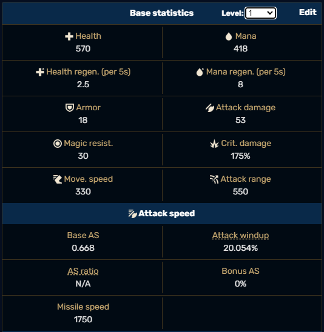{ width=50% height=50% }

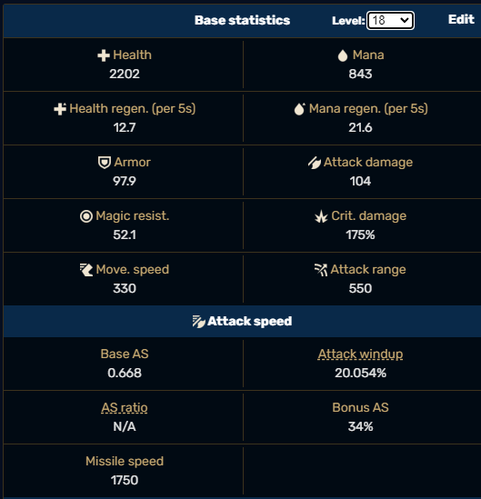{ width=50% height=50% }

Although all champions have relatively similar values, individual values for each champion should be considered to maintain accuracy regarding results. As a minimum requirement, the app should be able to let users choose their champion at their desired level while manually altering those of the target since they will also be required to calculate post-mitigation damage (see the previous section to understand pre- and post-mitigation damage). If time and resources allow it, the app should eventually let the user choose the attacked champion and their level as well for the result of the calculator to be more easily relatable to real in-game situations. However, the priority on this point is rather low.

### Ability Ranks

Another important variable when calculating the output of an ability is its current rank. Ability ranks work as follows: Whenever a champion levels up in a game, the player can choose to rank up an ability. Basic abilities (Q, W, and E) can usually rank up from rank 1 to 5, while the ultimate ability only has three ranks. A player can only rank up their ultimate ability to Rank 1 from champion level 6 onward, Rank 2 from champion level 11 onwards, and Rank 3 from

champion level 16 onwards, and finally, no ability can be at a rank higher than the champion’s current level divided by two and rounded up. That is to say, for example, given a champion level 8, even though they could have ranked up their abilities eight times, no basic ability could be at rank five since half the champion level rounded up is 4. Any champion has to be at least level 9 to rank up any ability to rank 5. These ability ranks are important since, as we have seen in the “Understanding abilities, pre- and post-mitigation damage - Abilities examples” section, ability ranks usually alter how much base damage an ability deals as well as, in some cases, even alter the scaling factors. We believe that the ability for the user to select ability rank-ups should be included in the MVP. Some protection should be implemented to deny the user from ranking up abilities in a way it would be impossible inside a real game (for example, having all abilities at max rank when the champion is level 6). However, the app’s main objective is to give players a tool to analyze and interpret the results; we should reduce the chance of errors to give more accurate results.

### Items and effects

The last of the fundamental variables in our app and the most important. During any match, players can buy items from a shop inside the game using in-game resources. These items, once bought, are equipped to your champion, and a max of 6 items can be equipped at any given time. Items provide champions different benefits when equipped; these benefits (commonly referred to as **buffs**) can be the following

- Stat buffs: Improve champion statistics (health, attack damage, ability power, etc.); most items in the game give some form of a stat buff.
- Passive effects: Are constantly active while the champion has the item equipped.
- Auras: Are buffs or debuffs that affect nearby friendly or enemy units respectively but do not affect the holder of the aura item.
- Active effects: Function similarly to champion abilities and we do not concern ourselves with them since their effect is usually rather simple and can be easily predicted without the need of a calculator.

Items are also classified into “quality tiers” increasingly as follows:

- Starter: Items intended to be effective during the beginning of the game and do not usually build into higher-tier items.
- Basic: These items provide a single stat attribute or special effect.
- Epic: Provide additional stats and/or effects with effects usually being lesser versions of the legendary item they build into.
- Legendary: Provide the greatest stat and a significant special effect. They do not build into any higher-tier items
- Mythic: Same as legendary items but they additionally provide bonus stats for every other legendary item in the inventory. Only one mythic item can be equipped at any time.

Some items possess the “unique” attribute, which means only one item that shares the same “unique” attribute can be present in the build. Let's look at the following example to make things clearer:

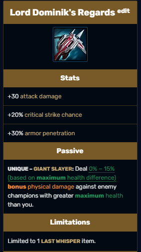{ width=40% height=40% }

{ width=60% height=60% }

As we can see, the item Lord Dominik’s Regards (LDR for short) provides three stats when equipped by any champion: +30AD, +20% critical strike chances, and 30% armor penetration, and it also gives a unique effect called Giant Slayer. In addition to doing exactly what it reads, this unique effect limits the item for it only to have one copy of it at any given time. Furthermore, we can see that the item has another limitation: its unique effect belongs to a group called Last Whisper; any champion is limited to only having one item from the said group at any given time. While most players from our target market should know about these limitations, implementing them in the app would be wise to avoid users getting unreplicable results. However, there could be some value in allowing further theorycrafting (Theorycrafting refers to mathematically analyzing game mechanics, usually video games, to discover optimal tactics or strategies).

### Dragons and Baron buffs

In the current version of League of Legends, there are currently 1 Baron buff and 6 Dragon buffs listed in the table below.

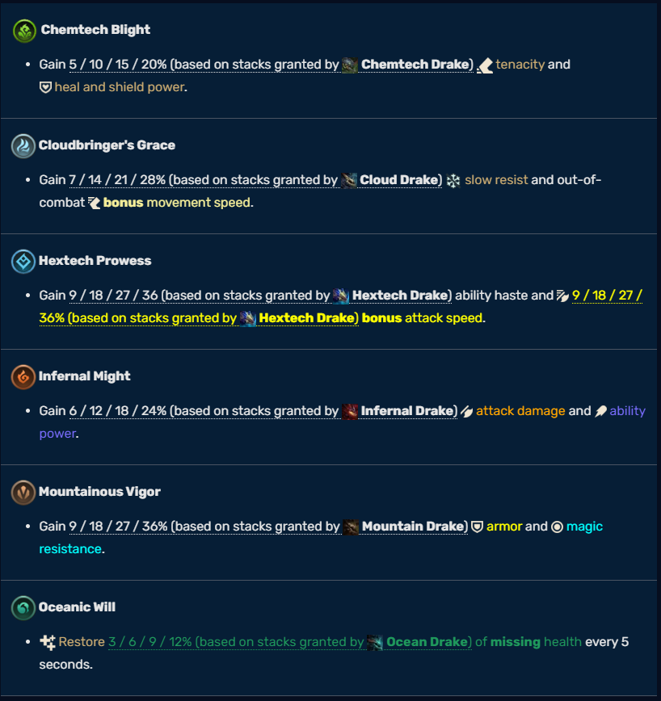{ width=70% height=70%}

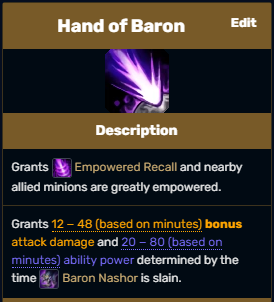{ width=40% height=40% }

Although these buffs can be obtained in a game, and they affect all the champions in one team either for a fixed duration or until the match is over, we will not concern ourselves with the effects of said buffs in our damage calculator. There are two main reasons for this decision, the first being that most of these buffs do not affect the damage output of most champions, and in the case, they do (like Infernal Might or Hand of Baron), they do in a straightforward manner of just flat out increasing the damage. Although we do concern ourselves with precision regarding the output of the damage calculator, as we have stated before, the main value we expect users will get from this app will come from looking at the relative differences between different build interactions for any given champion rather than the exact numbers. The second and last reason we ignore this game mechanic regarding our app is because “Dragon buffs” are randomly selected every game, and there is no way for any player to know which Dragon buffs will be available in their upcoming matches. Due to these two reasons, we see little value in implementing this feature into the app.

### Runes and Shards

Lastly, we have Runes and Masteries. Runes are a set of passives, similar to item passives but comparatively weaker than any player has to choose before they start a match. Skipping the details of how they are chosen, this game mechanic has similar issues to that of Dragon and Baron buffs regarding our calculator. The main reason is that most of the runes do not influence damage output whatsoever, and those that do, either do champion-independent damage of their own, increase champion stats by minimal amounts (less than even basic items) or amplify a champion´s damage output by really small amounts. Shards are simply a small amount of extra stats to the champion, as seen in the chart below.

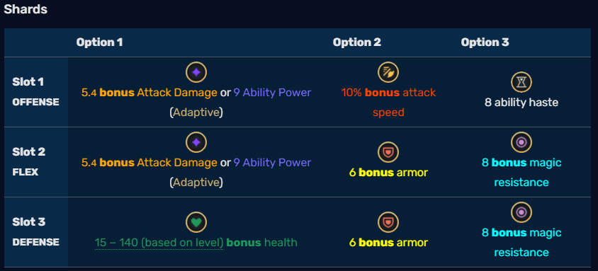{ width=90% height=90% }

We understand that by not implementing these systems into the calculator, we will be dealing with some margin of error when calculating the damage output of any champion ability or basic attack. However, we consider this margin small enough for its omission to deliver a product that can provide meaningful data to players to make better decisions when building their characters. We only close the door to their later implementation by our team or any other interested party once the calculator's first viable version is released.

### Damage calculation

Champions have mainly two ways of dealing damage, basic attacks or auto-attacks (AA for short), which are mainly physical damage, and abilities or spells, which can deal physical, magical or true damage. The amount of damage any AA or ability deals depends on the stats of the attacking champion and the stats of the champion receiving said attack. Let’s look at the following example: we have a level 1 Ahri (53 base attack damage) doing a basic attack on another enemy champion who, for this scenario, has 0 armor, hence 0% physical damage reduction. Since Ahri´s basic attack depends 100% on her attack damage and the enemy target has no physical damage reduction, the target is expected to take exactly 53 physical damage. Being able to simulate this type of scenario is the primary goal of the app. When the equipment gets involved, most of the equipment (commonly referred to as Items) gives stats to champions that possess them. Let's give the Ahri from our previous example the following item:

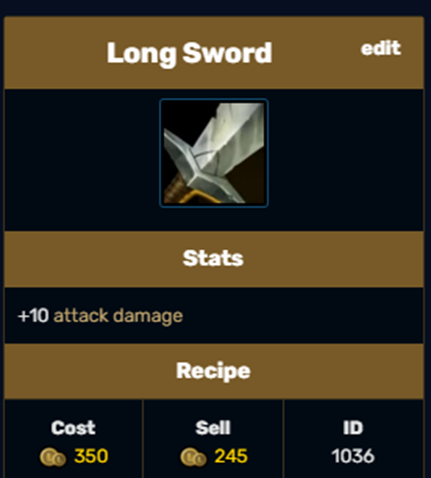{ width=40% height=40% }

And let’s say our enemy target now has 100 armor, equating to 50% physical damage reduction. As you can see, our level 1 Ahri with a long sword now has 63 total AD (53 base AD from itself + 10 AD from the long sword). If Ahri were to basic attack our now armor-equipped target, the damage dealt would be: Total damage from source _ Target’s Damage reduction = 63 _ 0.5 = 31.5 damage.

Each champion will have different damage formulas involving other stats for their abilities and their respective auto attack, but I hope this simple example helps you understand the topic better.

For further information regarding damage calculations, I recommend the following link: https://leagueoflegends.fandom.com/wiki/Damage, mainly the sections Damage type classifications and Calculating Damage.

### Understanding abilities, pre and post mitigation damage.

Every champion in the game has two main ways of dealing damage; one is by basic attacks, which we covered in the previous example, and the other one is through abilities. Besides some exceptions, most champions in the game have one passive ability, three basic abilities (usually referred to as their Q, W, and E abilities), and one ultimate ability (usually referred to as R). Although there is a wide variety of abilities in the game, their properties dictate how the abilities behave in-game; we will only be concerned with calculating the damage the ability deals if a target is hit. For this purpose, we will only care about the type of damage the ability deals (physical, magical or true damage), the abilities base damage (innate damage of the ability regardless of champion stats), and their scaling factors (which champion stats increase the damage of the ability). Here are some examples:

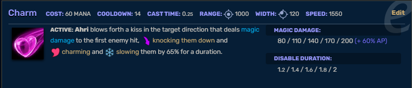{ width=95% height=95% }

The ability above, called “Charm,” belongs to Ahri; we will only focus on the damage part of the ability. As we can see, the description shows that deals 80/ 110/ 140/ 170/ 200 (+ 60% AP). The numbers in white are the ability’s “base damage”; this damage solely depends on the ability’s rank, which goes from 1 to 5. Adding to the base damage, the ability also deals more damage equal to 60% of the champion AP value; we say that the ability “scales” off AP (Whenever an ability increases its damage due to some factor, we say the ability scales of said factor, it could be champion level, ability level or most stats). Lastly, we can see that the ability deals magic damage; this means that we need to take the MR (magic resistance) value of the target when calculating the final damage dealt by

the ability. Now to make things clear with an example, let's say Ahri has its “Charm” ability at rank 3 (140 base damage) and has 100AP. The total damage of the ability will be 140 + 60 = 200 magic damage. Ahri's charm rarely deals 200 damage due to most champions having at least some MR; let’s give our charmed target 100 MR; this equates to 50% a magic damage reduction multiplier (Damage multiplier formula in figure 4 below). This would mean that if Ahri’s charm were to hit our target, its 200 magic damage Charm would only deal 100 magic damage to the target. To differentiate these instances of damage, we call “Pre-mitigation damage” the total damage of the ability from to its base damage plus scaling factors and “Post-mitigation damage” the actual damage dealt to the target that comes from the following expression:

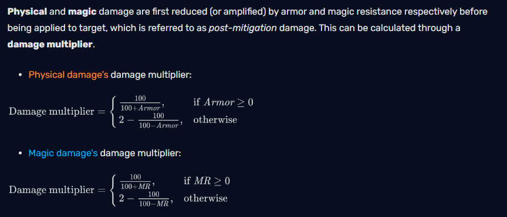{ width=95% height=95% }

Pre and Post mitigation damage is always the same when talking about true damage, but that is not the case for physical and magic damage, with a curious case being that the post-mitigation damage could technically be higher than the pre-mitigation damage given the proper conditions due to the nature of the formula.

### Abilities examples

We will show some extra examples skipping the damage calculation to give insight into how different abilities work. For simplicity, we will always assume the target has 0 armor and magic resist values meaning pre and post-mitigation damage are the same.

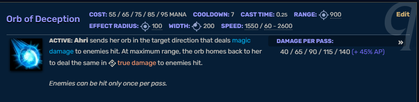{ width=95% height=95% }

Ahri's Orb of deception is a mixed damage ability that scales off AP, as we can read from the description the orb deals two instances of damage, the first one being magical damage and the second one being true damage.

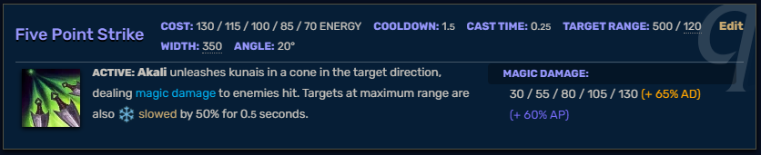{ width=95% height=95% }

Akali´s Five Point Strike is a magical damage ability that scales off her total AD and AP.

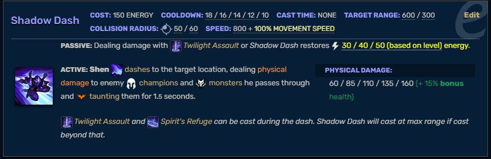{ width=95% height=95% }

Scaling of abilities is not limited to just AD or AP, as we can see; Shen´s Shadow Dash is a physical damage ability that scales of Shen´s Bonus HP. The word “bonus” means it takes into consideration HP gained from external sources such as items and not Shen´s base HP value; that is to say if Shen has 1100HP, but 1000 comes from his base HP stats and only 100 from external sources, the ability will deal a bonus 100*0.15= 15 damage only and not 1100*0.15 = 165 damage.

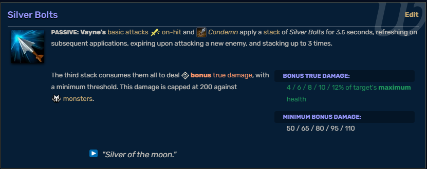{ width=95% height=95% }

Vayne’s Silver Bolts are a curious case of a true damage ability that scales off the ability level and the target's maximum HP, disregarding Vayne’s stats. Complementing the previous example, were Vayne to hit Shen, regardless of Shen’s current HP, the damage will be calculated based on Shen’s 1100 max HP value.

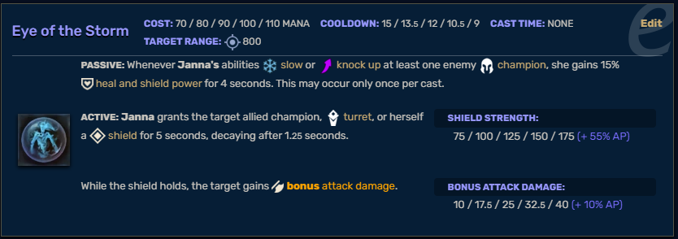{ width=95% height=95% }

Lastly, we can see an example of a nondamaging ability. Janna’s Eye of the Storm is an ability that, when casted into an ally, will give them a shield that scales off Janna’s AP value. In these cases, we would logically only calculate the amount of shielding or healing the ability gives. (Some items directly increase shielding and healing values).

### Extra information

Some extra links that could be helpful:

· [BoRK or BT? An analysis for Vayne Players in League of Legends by Chuqiao Huang, Journal of interdiciplanry Science Topics Volume 3 2014, University of Leicester](https://books.google.cl/books?hl=es&lr=&id=FnUhBwAAQBAJ&oi=fnd&pg=PA30&dq=league+of+legends+Damage&ots=IOMIYee5M4&sig=licJ1NXRPn5GCgpllBpqHbuGXZg&redir_esc=y#v=onepage&q&f=false)

Optimizers and calculators for reference:

· [Genshin impact optimizer/calculator with tutorials](https://frzyc.github.io/genshin-optimizer)

· [World of warcraft optimizer](https://www.raidbots.com/simbot)

· [Quick video explaining damage types in league](https://www.youtube.com/watch?v=ptxlodDl9Gw)

· [League of legends Wikipedia](https://leagueoflegends.fandom.com/wiki/League_of_Legends_Wiki)

· [League of legends documentation for developers](https://developer.riotgames.com/docs/lol)
