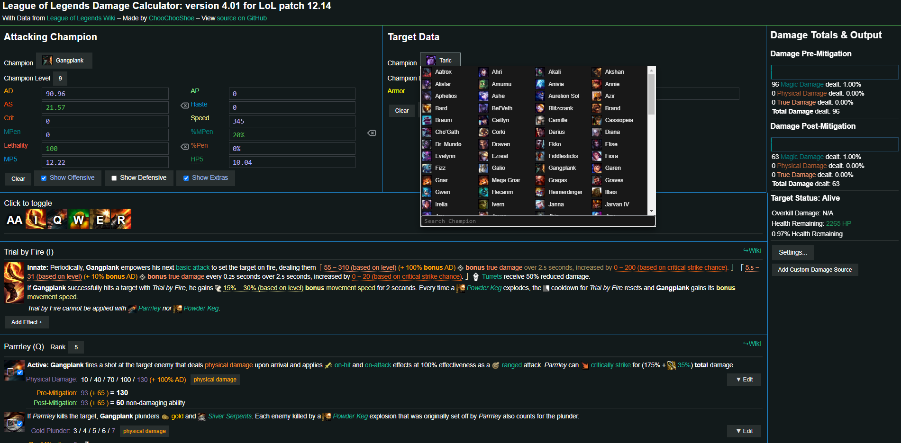

# Prototyping

## First iteration

It is important to remember that our app’s main objective is to be able to let the user alter some variables corresponding to the output of a given champion, and the app should update and show the user said output for each of the champion’s abilities and basic attack. The first low-fidelity prototype was made before the project was decided upon as an introduction to the rest of the team members on what the project would look like.

{width=90% height=90% }

As we can see from the previous templates, specifically *Figure 1*, we can differentiate various sections corresponding to the multiple variables needed for the final damage calculation and the use of colour coding for separating user input and the expected app output. While this initial prototype was designed extremely early into the development of the app, team members found it relatively simple and easy to understand with very little explanation, even those with little to no experience in videogames or these kinds of applications which gave us as a team what we believe a solid foundation for further prototyping. Note that our team consists of one member with over nine years of experience in League of Legends and other games, three members with some experience and one with little to zero experience in video games.

In *Figure 2*, we can see some initial ideas from further development conceived during one of the first team meetings, these include an optimization tool where the user would input a certain amount of gold (currency used in-game to buy items) as well as an optimization target, for example, Attack Damage, and the optimizer would respond to the user with a combination of items (item build) that would yield the highest AD within the gold specified gold cost. 

Although these were the first template designs, they did not come out of anywhere. There is inspiration from existing tools and some League of Legends interfaces to keep some sense of familiarity to our expected users.

{ width=90% height=90%}

The screen shown in *Figure 3* is what every player sees whenever they are about to start a game; this phase is commonly known as “Champion select”. Here, as the name suggests, players from both teams do their pre-game preparations by selecting their champion and their runes and shards before the game starts. We can see the different sections of the screen with ally champions to the left, enemy champions to the right and the main focus being the champion selector in the middle of the screen. We decided to keep the user-chosen ally champion to the left and the enemy target to its relative right for our app following the Champion select interface to keep it intuitive for the users. 

{ width=70% height=70%}

In *Figure 4*, we see an example of the match history of an example player. Every player will have access inside the game client to this interface, where it shows what game mode they played, whether the match was a Victory or Defeat, the item build the player had when the game ended, and some 

{ width=100% height=100% }

like game duration, gold earned, etc. While inside the game, the champion interface looks like in *Figure 5*; here, we can see a little table showing some of the champion’s main stats, the actual level of the champion, its abilities with the little yellow dots underneath indicating the rank of the ability as well as the current item build and available gold. I want to focus on the item build section and the different presentations between in and out of a match, while the gold remains underneath; having the items in either one or two rows results familiar for every player regardless of their level and remains as a decision based on the space available and opting for a more compact presentation when inside a real-time match. As for these sections, you will see some form of the item build section and the champion stats table in the higher fidelity designs.

## Similar projects

In this section, we will briefly discuss similar projects currently available on the web.  As we include some screenshots, we recommend exploring them a little if you are interested, as elements from all of them were considered for our current design template for the app. Links to each project can be found at the end of the report

{ width=100% height=100% }

For this first project, which is just a build calculator and not a damage calculator like ours, although it has not been updated in more than a year at our current time of presenting it (League of Legends is its patch 12.23 at the time of writing), we can see some elements worth considering for our design. Having filters for our item selector, as well as presenting them by their respective icons instead of their name, is very similar to the way items are presented in the in-game shop during a match, as seen in *Figure 7*; this has the advantages of keeping the sense of familiarity as well as bypassing any language barrier users may experiment by not knowing some of the items names but knowing their icons, a not so uncommon occurrence even in veteran players given the existence of over 150 items in the game currently. The runes selector is also identical to the in-game one presented during “Champion Select”, which adds to the users' sense of familiarity and ease of use, allowing them to use it even without a step-by-step guide. As for the rest of the app, there is much blank space; the rune selector occupies the same space as the items at the left, too many colours in the champion stats table, which may be useful to bring the attention of the user buy in a rather aesthetically unpleasant way and does not coincide with the colour palette used in-game as seen in *Figure 3* and *Figure 4*.

{width=100% height=100%}

We see an actual damage calculator for the next project (*Figure 8*). Some strong points about this project are the colour palette (very similar to the game-client palette), the abilities description and damage output for each ability is laid out similarly to how the Wiki page does this job, the champion selector is very compact and understandable together with a search bar for user ease as well as indicating different damage types together with pre- and post-mitigation damage. As for its weaknesses, each ability description seems poorly spaced, forcing the user to scroll down the page to see each ability; there is no build selector, so users have no constraints impeding them from selecting impossible values for Attacking champion or Target data. The user should get into the practice tool or manually calculate how much of each stat their item build, runes and extra buffs will give them to manually input the stats in this calculator to get an accurate result. Finally, the app does not work properly. Besides the fact that the app is currently updated for an old game version, some stats update while others do not, so we, as users, have no sense of the app working and giving accurate results.

{ width=100% height=100%}

And for the final project we will analyse, we have what we believe is the most accurate and currently up-to-date damage calculator for League of Legends currently available in the market.

{width=100% height=100%}

This project, being done completely in google sheets, has everything we would like to implement into our app as base functionality for a damage calculator. From attacking champion selector with levels and base stats, abilities and their rank, item builds for attacking and target champion, runes, and shard selectors and even some specific functionalities unique to some champions in the game, everything is clearly labelled in their unique sections with different colours. One excellent addition is the ability to have two item builds at the same time and swap them easily in one click allowing the user to quickly compare the damage output together with an “All in” section, which indicates the damage dealt using every ability available in a lapse of 3 seconds. Finally, the sheet even comes with a relatively simple but helpful battle simulator (*Figure 10*), which could be a nice addition to our app if there is enough user interest. Although the sheet, even with this level of detail, does not cover every possible scenario for dealing damage in the game, it comes close to covering them, considering the existence of over 160 champions and over 150 items in the game currently. On the other hand, the sheet, although helpful, is still a .xlsx, which is not mainly known for user-friendliness, even more with people with little to no experience with them, and it certainly falls short in the field of aesthetics and familiarity to the regular League of Legends player base. Even as our veteran League player member tested the sheet, it took some time to understand everything presented. Most of the cells and clickable lists are small, and zooming into the sheet requires the user to start scrolling vertically and horizontally, which is not able to do easily by holding the scrolling wheel in the mouse due to its function as a drag and select in the sheet. The sheet also does not present any restriction to the user preventing them from calculating impossible scenarios due to in-game limitations such as ability rank-ups tied to the current champion level or selecting three secondary runes when only two should be available.

{width=50% height=50%}

## Current Iteration { style="page-break-before:always;"}

The following wireframes represent the current iteration of the design of our application. Note that some colour outlines (Red outlines indicating user input and blue outlines indicating app output) have been added for clarity since these same templates were shown in a questionnaire aimed at friends and acquaintances familiar with the game when asking them for user feedback. Questionnaire results will be shown at the end of this section.

{width=100% height=100%}

{width=100% height=100%}

{width=100% height=100%}

{width=100% height=100%}

{width=100% height=100%}

{width=100% height=100%}

The previous wireframes show two possible layout distributions labelled as lines A and B. The numbers indicate our possible evolution of the app as we add more functionality corresponding to all the variables to consider when calculating damage. You will see elements from previously shown examples in our current wireframes, plus some adjustments we believe would make the interface more user-friendly and intuitive. Links to the Figma websites, where the templates can be more freely explored, will be found at the end of the report.

From our initial questionnaire, we realised that we asked our users about their preferences regarding wireframes from line A or B but have yet to ask them for more specific opinions about the designs. We consider this a significant oversight by our team. We are currently issuing a new questionnaire to a bigger audience of dedicated players where we especially ask about their opinion of the interface’s design, and we are ready to make changes accordingly. Besides that, here are the results from our previous questionnaire to friends and acquaintances familiar with the game regarding their preference for one or another line of templates.

Here in *Figure 17*, we can see a clear preference over Template line A, which we believe it is likely originated from the familiarity with the “Champion Select” screen from *Figure 3*, keeping our selected champion to the left of the screen and the target enemy champion to the right.

### Links

-   [LOL ITEM BUILD CALCULATOR](https://www.lolbuildcalculator.com)

-   [League of Legends Damage calculator by ChooChooShoe](https://choochooshoe.github.io/c/Ahri/vs/Taric)

-   [League of Legends Damage Calculator by Crixaliz](https://docs.google.com/spreadsheets/d/1NrhB6aNDLuAZv8BYQzAIPZYgXLlmXOHsoCqPxm0mfWw/edit#gid=1589047938)

-   [Figma wireframes](https://www.figma.com/file/yPxXo1ScmEF1MgYvhJN3Ef/AnDS-LoL-Damage-Calculator-Wireframes?node-id=0%3A1&t=3wa3X9Tt4c6Z6LLw-0)
