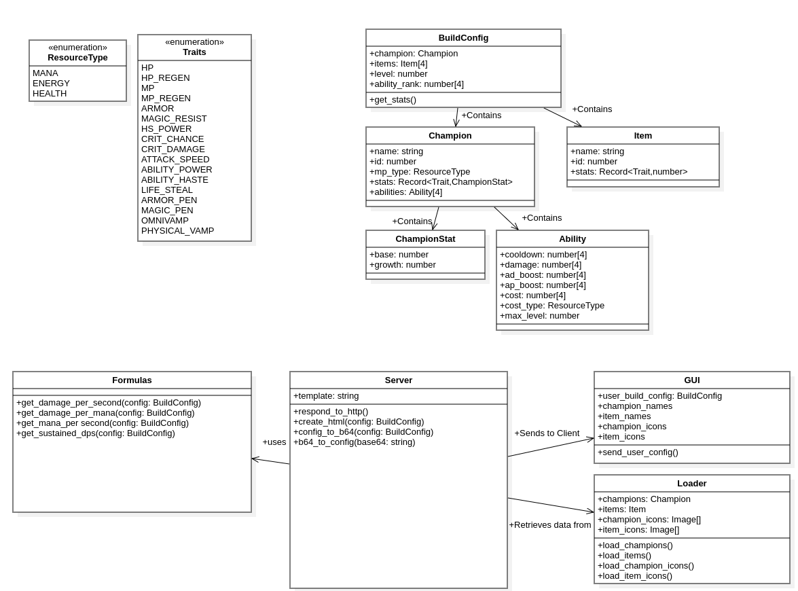

# Specification

### NodeJS

There are two primary ways in which websites are built: as static web pages or as a web server. We will be using a web server as this provides more flexibility over a static page. For instance, it will be possible to implement a feature that embeds the configuration of the calculator in the URL, allowing for easy sharing of builds between players; this would not be possible with a static page. The most popular framework for building web servers is NodeJS[^21]. NodeJS also provides other libraries and tools as packages (via NPM), which makes project configuration much easier. For these reasons, NodeJS and NPM will form the backbone of our project.

### Typescript

NodeJS web servers use Javascript as their primary language (NodeJS is, after all, a Javascript runtime). This means that Javascript will be a mandatory language for our project. This provides no obstacle, since all team members have experience with Javascript. Typescript is a language which can be compiled into Javascript, and is often used as an alternative to Javascript. It also provides several useful features: easy module management, type safety, and compile-time error detection. This will help to keep the program stable without the need for each team member to fully understand everyone else’s code. Typescript is also nearly identical to Javascript in syntax, and most popular Javascript libraries can be used seamlessly with Typescript. This makes Typescript the language of choice for this project, and the only programming language we expect to need.

### Express

Express is a library which helps to streamline and simplify the process of creating and running a web server, and is extremely popular for NodeJS servers. This library is also used in the “Databases, networks and the web” (CM2040) course, so some team members already have limited experience with it.

### EJS

The Embedded Javascript templating library (EJS) will also be used. It allows for Javascript code to be used directly in HTML files, making it very easy to learn for anyone with Javascript experience. It can also be implemented easily, only requiring a few lines of code for the entire process.

### Data Source

There are multiple potential sources of data for this project. The official source of data on in-game item and character properties is provided by Riot Games in “Data Dragon”[^23], a collection of JSON files which can be downloaded from their website. However, these files are known to be incomplete and inaccurate in almost all cases. This is a problem that others have faced before, some of whom have created their own data by scanning the game’s installation files directly; this is called Community Dragon[^24]. This data is not easily usable though, as much of it has been obfuscated. The format of the data also varies significantly from champion to champion, meaning a custom implementation would be needed for most. The source we have settled on using is the League of Legends Wiki[^22]. More specifically we plan on scraping data from the wiki and using some minimal post-processing to bring it to a more usable format. This works much better, since the data has been entered and verified manually by volunteers and is thus much more accurate and consistent than either Data Dragon or Community Dragon. This data will be stored on the server as plain JSON files. A database system is not necessary, since the volume of data is small and will not change.

### Accessibility/Usability

Additional requirements for the site are standard. Color coding should keep those with limited color vision in mind. Icons and images will be accompanied by appropriate text as well. Since the site will likely be used to expedite the process of comparing various in-game builds, it should be made as quick and easy as possible to configure and modify a build. There are no security considerations that need to be made (beyond standards expected of all sites, such as HTTPS), since no user data will be stored on the server after a request is handled and no credentials will be required for public access.

### UML Class Diagram

{width=90%}

[^21]: https://www.statista.com/statistics/1124699/worldwide-developer-survey-most-used-frameworks-web/
[^22]: https://leagueoflegends.fandom.com/wiki/League_of_Legends_Wiki
[^23]: https://developer.riotgames.com/docs/lol#data-dragon
[^24]: https://www.communitydragon.org/
