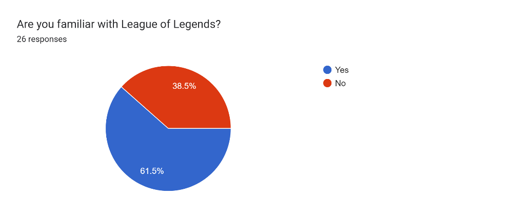
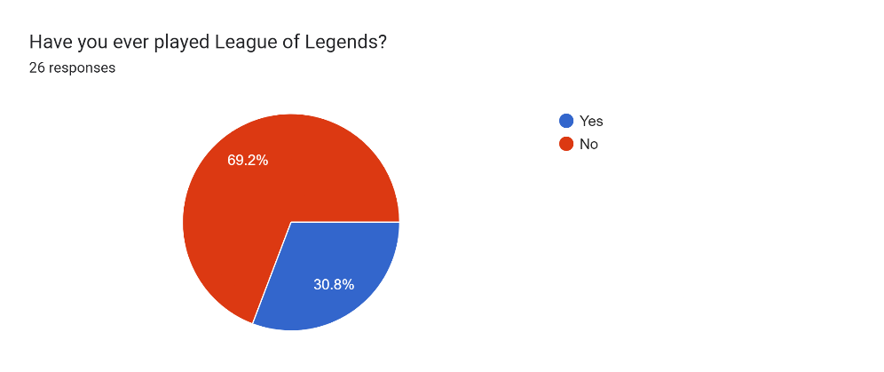
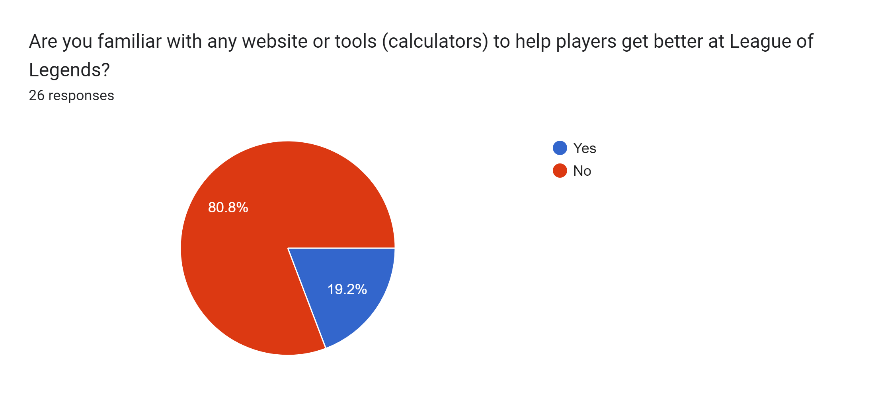
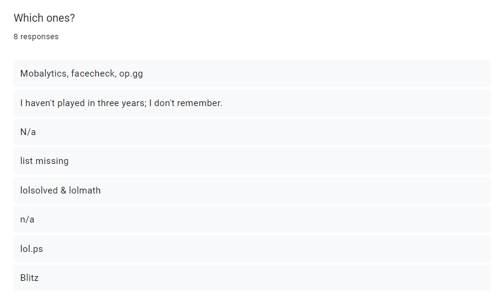
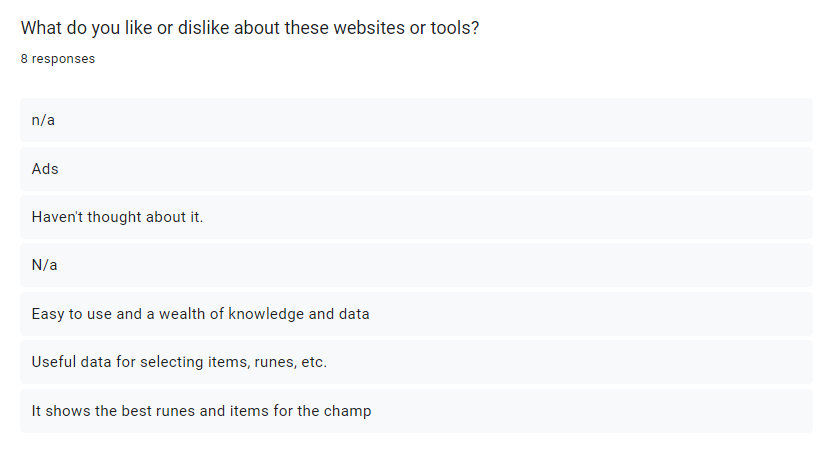
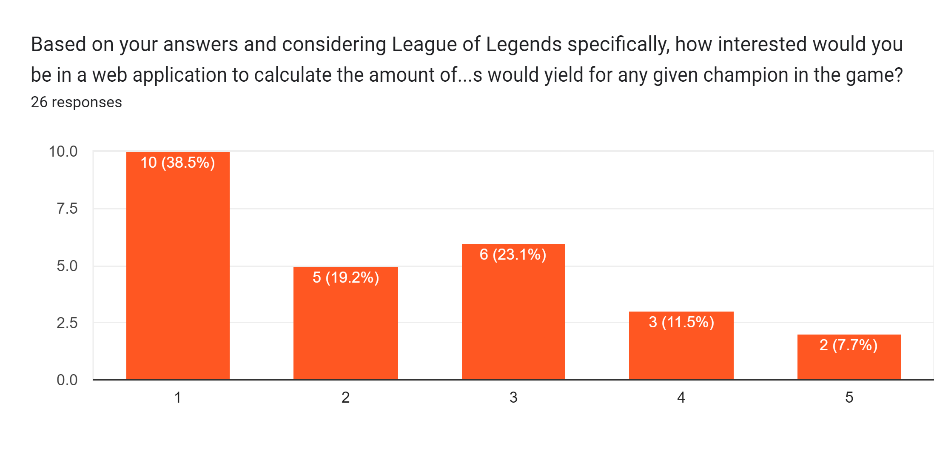
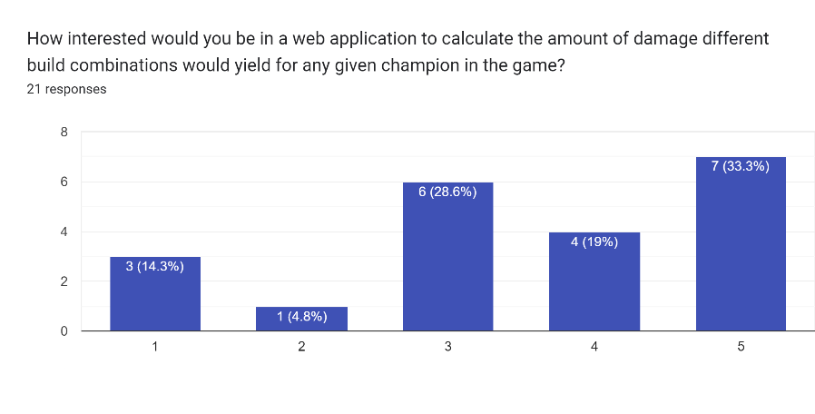
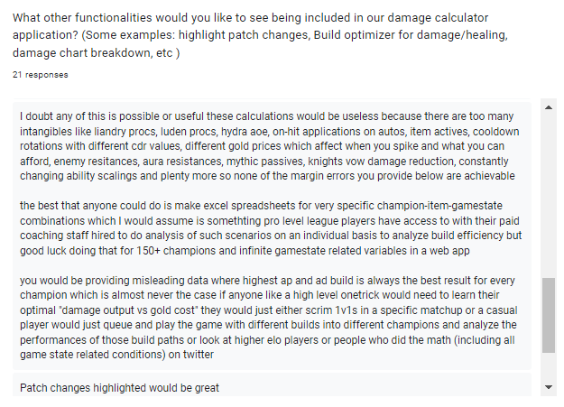

# Aims, Objectives, Requirements

After carefully considering the idea for our proposal, our main aim is to create a tool that will help experienced League of Legends players in their strategy planning for level of damage under specific circumstances, as well as making the use of the system simple, understandable, and as straightforward as possible.

Furthermore, our main aim is divided into smaller, more specific aims which coincide with the steps we decided to take to approach the project; at the same time, these aims are divided into particular objectives described as bullet points as follows:

[Aim]{.underline}: Provide a detailed plan for the calculator tool project

-   Research and choose the most appropriate project management tools for our team

-   Define the scope of the project

-   Decide on the research approach and how to execute it

[Aim]{.underline}: Choose the requirements and specifications based on the research we have performed

-   Create a survey to get qualitative feedback on the subject of the League of Legends game itself and people's experiences with it

-   Carry out robust market research to identify the target userbase

-   Analyze existing tools which provide similar functionality to what we are looking to achieve

-   ~~Perform assumption testing using the results obtained from the above~~

[Aim]{.underline}: Provide low and mid fidelity prototypes of our web application

-   Create several web application prototype models that showcase the functionality we are trying to achieve on a couple of different layouts

-   Feed the previously mentioned prototypes to a focus group of experienced players of the game through a survey and obtain feedback on the layouts presented

-   Discuss on the different ways these prototypes can be improved

## Requirements elicitation { style="page-break-before:always;"}

Our first approach to gathering information to set the first iteration of requirements involved creating a questionnaire with several questions about people's general knowledge of League of Legends and other multiplayer online videogames; this questionnaire was directed at the general public, without particular focus on any target users just yet. The survey, which was created using the Google Forms platform, was sent to the University of London's Slack workspace to be filled out by other students of the BSc in Computer Science degree.

{ width=80% height=80% }

{width=80% height=80%}

The goal of this first survey was to get a general idea of what people knew about the game and the existing tools to aid its users, as well as gathering information on other games of the same nature and any other similar tools. Originally, this would serve as a reference point, as we would use the information gathered to compare the strengths and weaknesses of these other tools in the context of the respective games they are created for, and how we could utilize some of that knowledge and translate it onto our own application.

We realized fairly quickly, however, that the results from this first survey were not as or helpful as we had hoped. We were missing more specific responses that would help us understand more explicitly and unambiguously the types of features that would be expected for such a calculator tool. Additionally, we found that without a focus group of users that could potentially be interested in our application, the general interest for it was not present as much.

Following our planning discussion beforehand, we decided to create a different questionnaire using some of the questions from the first one and added more League of Legends user-specific questions, such as asking for the current in-game rank, the level of interest for a calculator tool for this game in particular, and an open-ended question about the functionalities that actual users would be interested in seeing included in the application. This new survey was sent out to a chosen focus group of people who are regular players of the game (*where was the survey link sent to exactly?*)

This time, the open-ended responses were much more thorough, as shown in the following screenshot of barely one section of the questionnaire. With these results, it seemed like we could gather enough details to begin working on the basic requirements for the application. However, we noticed we had a slightly different problem this time; the experienced users feedback was much more specific and thorough than we had expected at first. Our reasoning for this outcome was that the open-ended questions were left *too* open, and as such, the users described functionalities that are much more particular in comparison to any similar websites and tools they had used before.

