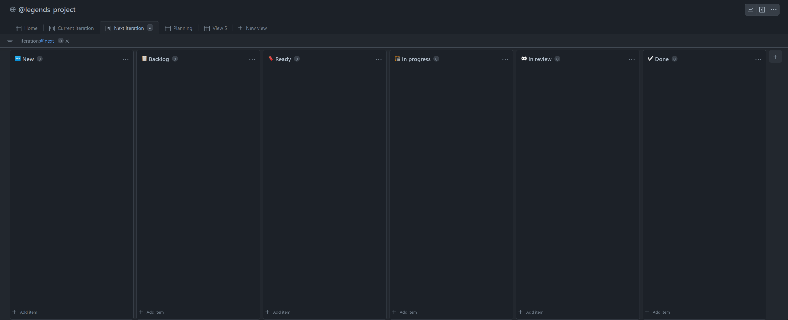
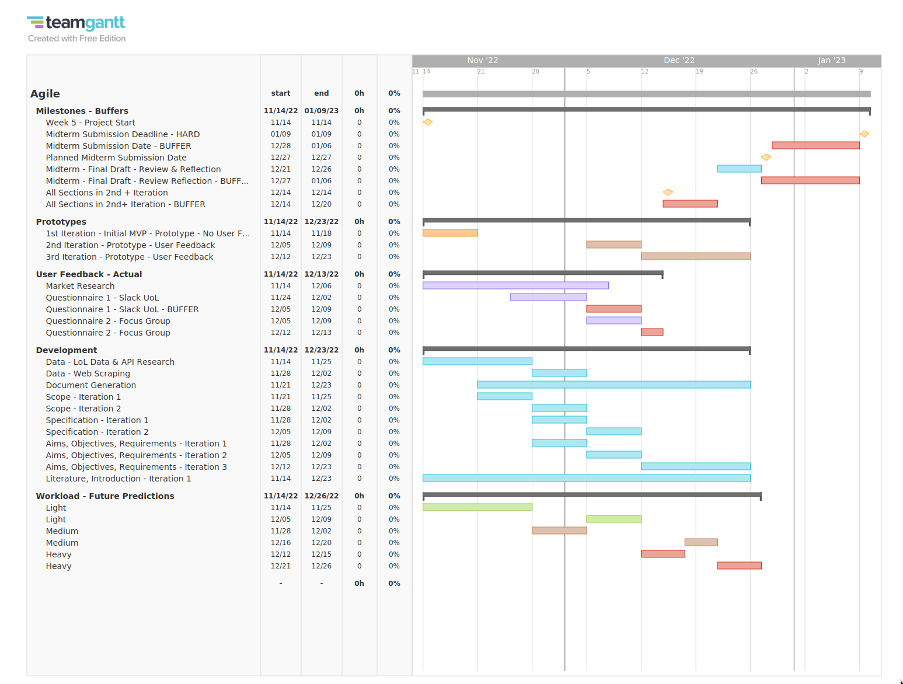

# Appendix

# Midterm Extracts

*The following content has been extracted from the midterm submission, so it can be referenced in the final deliverable*

## Project Planning

### Manubot Contribution Workflow

To provide pre and post edit collaboration tools, our team planned to implement a simplified version of the [Manubot contribution workflow](https://greenelab.github.io/meta-review/) to collaborate on the report. This contribution workflow is centred around using GitHub’s Pull Request review interface to allow any team member to comment on any other member's changes, globally or at specific lines, by asking questions or requesting modifications. A Pull Request is opened for every change.

{ width=60% height=60% }

In addition to this, we would collaborate using a [shared repository model](https://docs.github.com/en/pull-requests/collaborating-with-pull-requests/getting-started/about-collaborative-development-models#shared-repository-model). Forks were not used to initiate pull requests, and our team collaborated in a single shared repository. All Pull Requests were from branches within the same repository.

{ width=70% height=70% }

{ width=70% height=70% }

### Pandoc - Markdown -> PDF / HTML conversion

By switching from Github Flavoured Markdown to Pandoc Markdown Extended Syntax, and using [pandoc](https://pandoc.org/) to generate an HTML version of our written material, the report benefitted from:

- automatic generation of table of contents, footnotes lists, and numbered headings
- styling any written material with CSS
- preprocessing of multiple files into

The output HTML from pandoc was converted to a PDF using [prince](https://www.princexml.com/)

{ width=55% height=55% }

Due to the use of Pandoc Extended Markdown Syntax, the Github Web Markdown Viewer rendering GFM flavored markdown did not show a true representation of our work we were collaborating on. Therefore, it did not make sense to keep using this viewer.

In preparation to implement the newly revised workflow, all the markdown content on the wiki was moved into the repo so it could be tracked as version control (docs-as-code approach), and we could perform PRs on the content. After this, all files related to the project were now under version control.

## Github Project Management features for App Development

During the second half of the module, our team plan to use Github's project management features to manage the development of the app, so we do not have to learn any other project management tools.

Below is an outline explaining how we will use Github's project management features to manage our project.

- Github Issues provide an interface for collaborative code reviews and discussion of the task.

- Tasks each team member are required to fullfil can be shown by assigning an assignee to the Issue.

- Tasks can be grouped for better organisation, by labelling Issues: frontend, backend, documentation.

- Github Projects provide an interface to manage the project at a high level, showing the upcoming deadlines and milestones. This UI interface is similar to a Kanban board.

{ width=100% height=100% }

- linking low level goals to high level goals, by using Github Milestones feature. Every issue can be assigning to a Milestone, indicating what needs to be completed before the next milestone begins. This is integrated with Github Projects view / Kanban board feature.

## Gantt Chart { style="page-break-before:always;"}

Our team used a Gantt Chart provided by [teamgantt.com](https://teamgantt.com) to track the project's progress.

{width=100% height=100%}

### Iterations

The iterations for sections shown in the Gantt Chart defines a period where we received feedback from surveys, market research, or our focus group and developed and refined the feedback into the project.

By including these iteration cycles into the Gantt chart, we could show the project's progression more clearly.

### Buffers

The Gantt Chart shows buffers that define a period of time after our scheduled work. If we did not finish the work by the buffer end date, the work we planned in the future would have to be adjusted to compensate.

This was important when scheduling the time designated for obtainining responses for our surveys, as our team could only estimate how long it would take for us to gain feedback from them that satisified our needs to improve and iterate on aspects of the project. If we did not gather satisfactory feedback by the buffer end date, we planned to accept the responses as they are, as spending more time gathering responses would affect other deadlines we set in the future.

Most work was completed on schedule in the time alloted in the Gantt Chart. Some tasks ran into the task's alloted buffer zones, and there were only a few times the Gantt chart was adjusted. 

### High Risk Areas / Workload

Our team planned for weeks where the project demanded more resources, and noted these periods in the Gantt Chart. These planned work areas ensured all members of our team spent more of our resources at the same time, and managed our team's planned work expectations.

This section of the Gantt chart was adjusted throughout the project's development. 

After our second user feedback iteration, a second high risk area was identified after our surveys / questionnaires ran behind and the Gantt Chart was edited to show this.

