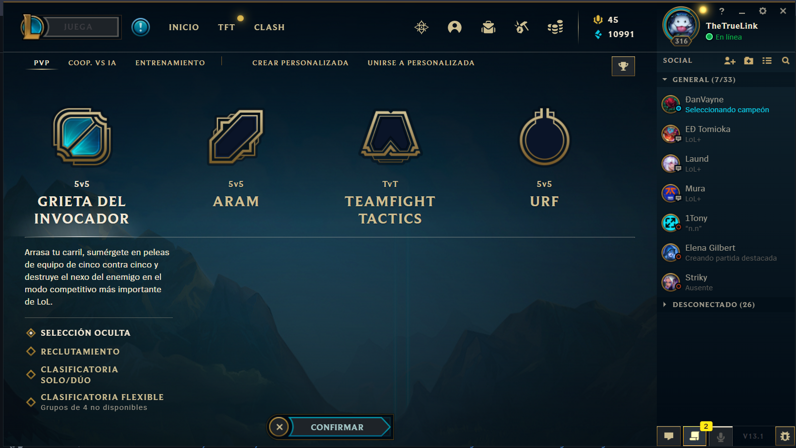

## Design & Styling

### Initial Design
Show styling references here, and decision to create the UI similar to the in game UI, as there would be a level of familiarity.

- league of legends wiki
- lol damage calculator
- in game UI

{width=100% height=100%}
{ width=100% height=100%}
{ width=50% height=50%}
{ width=70% height=70%}

### First Iteration - Testing (UI Evaluation)

{width=80% height=80%}

In the diagram 1 you can see that the majority of our focus group liked the overall design of the
app. However, there is always room for improvement and as it is our only first MVP we believe
that the results are quite good.

{width=80% height=80%}

The diagram 2 shows that the respondents found the color palette pleasant to look at. We took
the main colors of the logo League of Legends game to make the interface more familiar look to
our users.

{width=80% height=80%}
{width=80% height=80%}
{width=80% height=80%}

Diagrams 3 and 4 shows that most users found the app easy to navigate overall. However, there
are some people who had some doubts. We believe that this could be because the rank of the
displayed ability is not that obvious (Diagram 5). And also because it was not clear enough that in
the selectors you could either choose from the list or type the name of the item or character.

### Styling

The color palette was chosen based on the main colors that are used in League of Legends (LoL)
game interface. As our app is aimed mostly at the experienced players of LoL game, those colors
that we chose would bring the level of familiarity to the users.

{width=60% height=60%}

Image 1 shows the logo of the game and the main colors that are used in the game. So, the
borders of elements in our app are gold. The input text is white as in the game UI. Also, the
background picture of our app is taken from the original game.

{width=100% height=100%}

The prototype A2 (Image 2) was chosen by our focus group for our final MVP. We did the
symmetrical selectors for Ally and Enemy sections and put in the middle the whole information
about abilities and damage output.

{width=100% height=100%}

As you can see in the image 3, the current UI of the app is done using the in-game icons, colors
and background. The feedback on the layout and the design from the focus group was good and
is presented in the testing section.

{width=100% height=100%}
{width=100% height=100%}
{width=100% height=100%}

The images 4, 5 and 6 are presented as the references that we took for our app.
