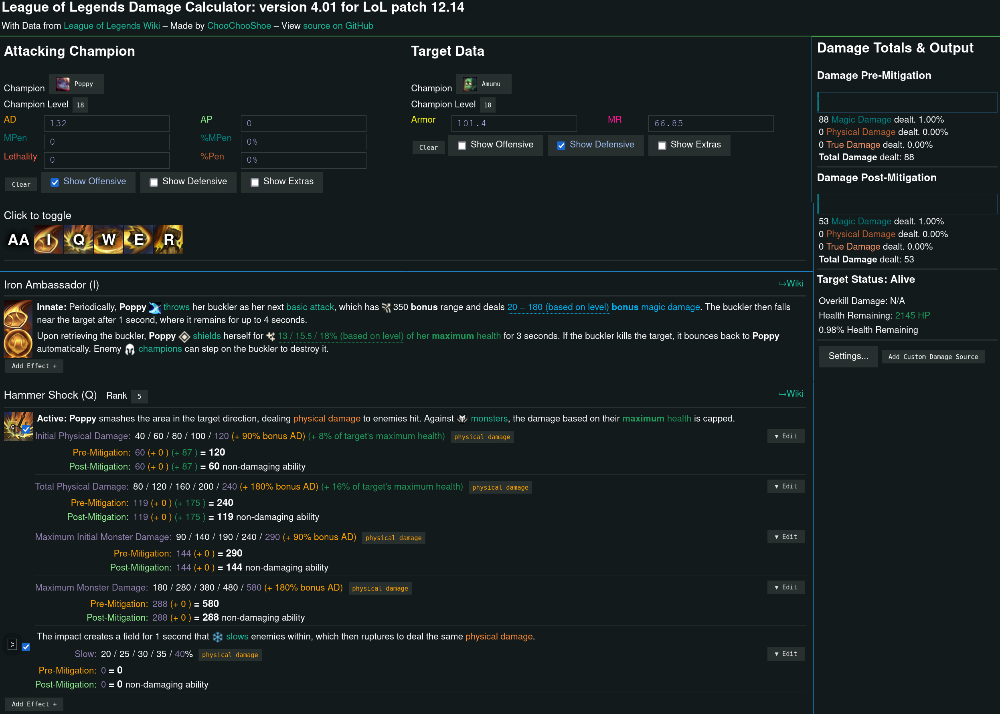

## Design & Styling

### Initial Design
Show styling references here, and decision to create the UI similar to the in game UI, as there would be a level of familiarity.

- league of legends wiki
- lol damage calculator
- in game UI

{width=100% height=100%}
{ width=100% height=100%}
{ width=50% height=50%}
{ width=70% height=70%}

### First Iteration
- survey questionnaire images and responses here.

