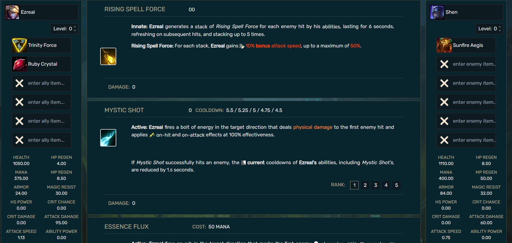

## Design & Styling

### Initial Design & Styling

When making decisions regarding styling for the app, the main objective was   to achieve a layout which results intuitive for our average expected user without the need for any instructions or tutorials besides each button or selector label in the app. This is to say the user should be able to comprehend every button, selector and display in the app by just looking at them when using the app for the first time. Although such task may sound extremely difficult, to accomplish the objective we relied in the knowledge that our target user for the app is an individual fairly familiarized with the game League of Legends. By knowing this, we focused on styling the app with the intend to keep similar UI elements to the one in game in order to transmit familiarity to the use and by doing so making it easier for it to use and understand.

First off we started from our wireframe, prototype A2, which received more positive feedback in our initial questionnaire regarding layout that we did for our midterm delivery.

{width=100% height=100% }

From there, we first took a look at the League of Legends game client and logo to get a general idea for the color palette as well as more specific styling elements like font, borders, padding, background, etc.

{width=100% height=100%}

{ width=100% height=100%}

{width=100% height=100%}

{width=100% height=100%}

{width=60% height=60%}

Image 6 shows the logo of the game and the main colors that are used in the game. So, the borders of elements in our app are gold. The input text is white as in the game UI. Also, the background picture of our app is taken from the original game.

We can see a clear use of background images, differences in brightness for distinguishing sections in the UI, and a distinct color palette together with other elements that were implemented in our current version of the app.

](assets/pablo-design/image005.png){ width=100% height=100%}

The color palette was chosen based on the main colors that are used in League of Legends (LoL) game interface. As our app is aimed mostly at the experienced players of LoL game, those colors that we chose would bring the level of familiarity to the users.

Although the main styling decisions came from the game client, for the abilities display section we decided to take inspiration from the [League of Legends fandom wiki page](https://leagueoflegends.fandom.com/wiki/K%27Sante/LoL) and the [League of Legends damage calculator from ChooChooShoe](https://choochooshoe.github.io/c/Ahri/vs/Taric). Most of the abilities display styling inspiration came from the wiki since players will be more familiarized with the wiki rather than the ChooChooShoe’s calculator which has not received an update in a long time as well as being similar to the in-game abilities description but with detail.

](assets/pablo-design/image006.png){ width=100% height=100%}

{ width=100% height=100%}

{ width=100% height=100%}

Combining all the previously mentioned elements together with the extra assets gathered that were mentioned in previous sections we arrived at the current styling for the MVP version of the League of Legends damage calculator app. The current UI of the app is done using the in-game icons, colors and background. We did the symmetrical selectors for Ally and Enemy sections and put in the middle the whole information about abilities and damage output.
The feedback on the layout and the design from the focus group was good and is presented in the testing section.

{ width=100% height=100%}

### First Iteration - Testing (UI Evaluation)

{width=80% height=80%}

In the diagram 1 you can see that the majority of our focus group liked the overall design of the
app. However, there is always room for improvement and as it is our only first MVP we believe
that the results are quite good.

{width=80% height=80%}

The diagram 2 shows that the respondents found the color palette pleasant to look at. We took
the main colors of the logo League of Legends game to make the interface more familiar look to
our users.

{width=80% height=80%}
{width=80% height=80%}
{width=80% height=80%}

Diagrams 3 and 4 shows that most users found the app easy to navigate overall. However, there
are some people who had some doubts. We believe that this could be because the rank of the
displayed ability is not that obvious (Diagram 5). And also because it was not clear enough that in
the selectors you could either choose from the list or type the name of the item or character.

