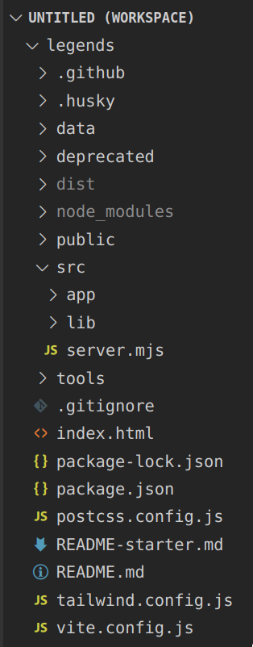
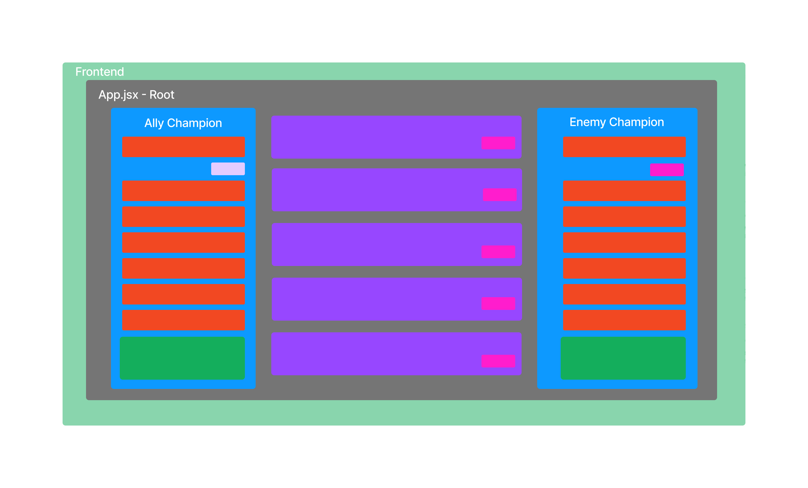
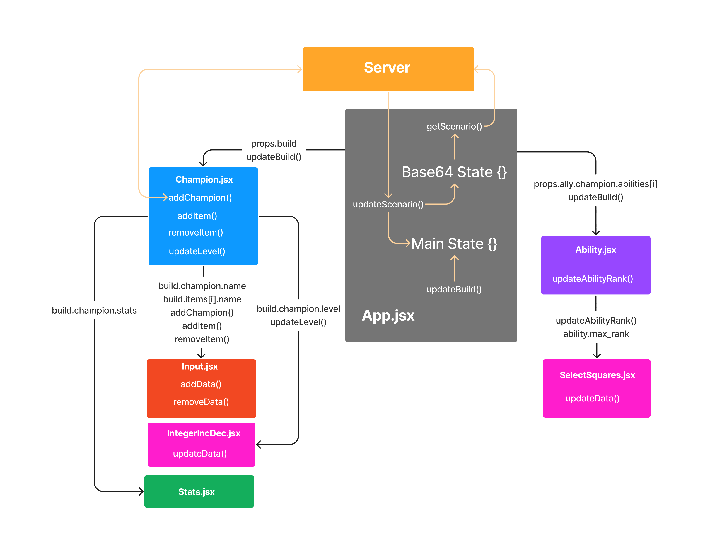
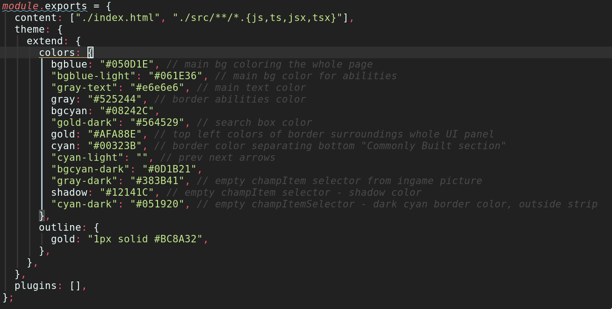

## Frontend

### React

React is a free and open-source front-end JavaScript library for building user interfaces based on components.[^react1]

Our team decided to develop the frontend using React as the application required constant page updates after initial page load. 
Templating engines were considered but did not provide the control we needed to implement all of the application's features.

As React is only concerned with the user interface and rendering components to the DOM[^react2], additional libraries were used. [react-query](https://github.com/TanStack/query) was used for state management. [floating-ui](https://floating-ui.com/) was used to create the champion and item selectors.

#### Repository Structure

The initial setup of the repository was accelerated by starting from a clone of [Vite-React-Express Boilerplate](https://github.com/joeynguyen/vite-react-express-boilerplate). This provided us a foundation to start building our application.  The use of the boilerplate in our project was permissible due to its MIT license. 

Below is a summary of all directories in the repository. Files were managed together when they fit a similar purpose.

| Directory/File       | Description |
| --------------- | ------------ |
|src/server.mjs    | server entry point |
|src/lib/           | server modules |
| src/app/main.jsx | client entry point |
| src/app/*.jsx    | client modules |    
| src/app/components/*.jsx | client modules |
| /*.config.js | vite, tailwind, postcss config |
| public/       | statically served assets |
| src/app/assets/ | Vite bundled assets |
| data/ | server and client data files | 

Table: summary of directories in the application's repository

#### Modules - Components
If a component could provide functionality in more than a single part of the user interface, it was encapsulated into and exported from a module.

Instead of artificially separating technologies by putting markup and logic in separate files, React separates concerns[^react3] with components. This approach was followed while creating the components of the application. 
Below lists every React component used in the application, what they are intented to display, and their logic.

| Component                      | Functionality / Display                                                      | Logic                                   |                               |
| -------------------------------- | ---------------------------------------------------- | ------------------- | 
| components/Ability.jsx           | a single champion ability                            | update ability rank
| components/Champion.jsx          |  container / view - shows ally/enemy champion,stats,items,level | update any champion attribute - champion,items,level |
| components/Input.jsx             | display and select a single item / champion          | update item/champion
| components/IntegerIncDec.jsx     | champion level selector with inc dec buttons         | update champion level
| components/SelectSquares.jsx     | ability rank squares                                 | update ability rank
| components/Stats.jsx             | champion stats                                       | display a subset of stats

Table: Explanation of each custom React component functionality in the project, what it displays, and the contained logic.

**Utility Component**

The React component, located at **src/app/shared.jsx** contains utility and wrapper components to be imported anywhere else in the application. 
React provides the ability to pass components into other components. This technique is used in the application to apply borders to components, while also keeping a single copy of the styling for the border. `Border` `ShadowBorder` components in this file implement this.

`ImgWithDefault` component is also included that wraps an  element, and provides a custom `onError` callback handler if the src attribute path cannot be found.

The addition of utility components into the project prevented code reuse, and made maintaining the application easier.

**Component Layout**

{width=100% height=100%}

#### State Mangement

Frontend state was managed inside a single object using React's `useState()` hook, and was initialised using the same types used to initialise the backend. The state was stored in the root component and was the source of truth for the other components. Child components accessed the main state object via prop drilling. 

In certain cases, data had to be passed from child components up to the root component, such as changing the value of the champion's level or ability rank in the main state object when a user interacts with the interface. This was implemented by passing a setter function from the parent component to the child components. When handlers were called in the child components, these functions were called to set the data.

Every time the frontend's state changed, the state object was base64 encoded and the string result stored in a variable managed by React's `useState()` hook. Anytime the base64 encoded string changed value, a callback function was called, and a GET request was sent to the scenario endpoint of the server that included the base64 string in the URL. Triggering callback functions on variable state change was implemented with the `react-query` library. This implementation allowed scenario data to be refreshed every time the user interacted with the interface.

#### Data Flow

React's `fetch()` API was used to perform GET requests to the server. Every time new data was received from the server, it was merged with the frontend's main state object. 

To populate the champion and item selectors, the server sends a file to the client containing a map of names to IDs when the application is first visited by the user. The name is used for display on the user interface, the ID is sent to the server when a user selects a champion or item.

When a new champion is selected using the champion selector dropdown, the child component `Input.jsx` calls the function on the parent, `Champion.jsx`, and passes the name of the champion. a GET request, including the champions name, is sent to the champions endpoint on the server, and a complete champion data object is received, then the setter function is called on the parent above, `App.jsx`, with a callback function as its input argument. The callback function contains the new state of the main state object.

This flow of data is similar when a new item is selected using the item selector dropdowns, but a GET request is not performed, as no server side data is necessary for items. The id and name of the item the user selected are stored in the main state object.

{width=100% height=100%}

### Tailwind CSS

Tailwind CSS is a library that creates a list of utility CSS classes that can be used to style each element. Instead of creating classes around components, classes are built around a specific style element.[^tailwind1]

React encapsulates logic and HTML, rendered using JSX, into a component. With the addition of Tailwind, classes were written inline on elements to style the HTML elements rendered by the component, providing further encapsulation.

**Theming**

Tailwind provides the ability to define a custom color palette, so they can be used as classes on elements. Custom colors from the team's chosen design were added to the project's tailwind configuration so the application could be styled and themed using inline styles, minimizing the amount of code that exists outside each component.

{width=100% height=100%}

### Vite - Rollup 

Vite provides a full development server and an optimized build command using Rollup. It is an alternative to create-react-app.[^vite1]
It was added to the project during development to ensure the application was being bundled correctly for production use.
Vite is configured by editing `vite.config.js` at the project root. Changes were made to the default configuration, and are listed below. 

**Static Assets**
Any static assets imported into the application return a resolved public URL when the application is served. This was adequate for assets with a static path and imported/loaded on application start, such as default champion icons, and the background image. Vite also served any assets located in the `public` directory under the project root, and using it provided a simpler approach for dynamically loading assets compared to utilizing the ECMAScript module syntax for dynamic asset loading.

[Thumbnails were displayed in the champion / item popup by dynamically loading them from the public folder](assets/frontend-item-popup.png)

**Data Paths**

Any modules under the `external` array of the rollup configuration are treated as external peer dependencies, and are not bundled with the application.
Data files for the server were declared in this array so Rollup excluded them from the bundling process.

[^react1]: [Wikipedia - React](https://en.wikipedia.org/wiki/React_(JavaScript_library))

[^react2]: [Wikipedia - React](https://en.wikipedia.org/wiki/React_(JavaScript_library))

[^react3]: [reactjs.org - introducing jsx](https://reactjs.org/docs/introducing-jsx.html)

[^tailwind1]: [Wikipedia - Tailwind CSS](https://en.wikipedia.org/wiki/Tailwind_CSS)

[^vite1]: [CSS Tricks - Comparing the New Generation of Build Tools](https://css-tricks.com/comparing-the-new-generation-of-build-tools/#aa-vite)

