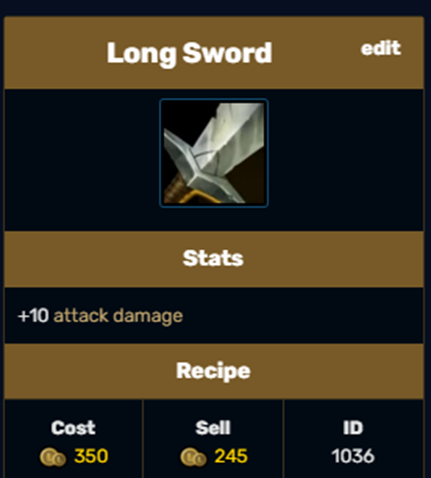
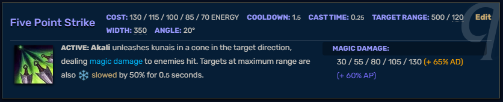
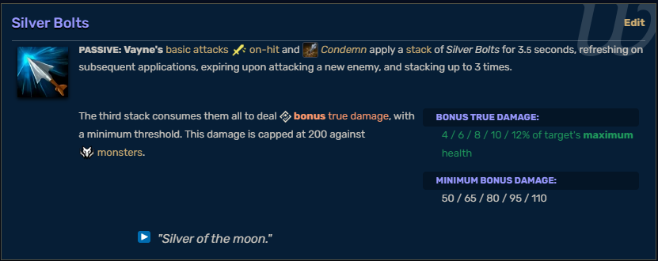
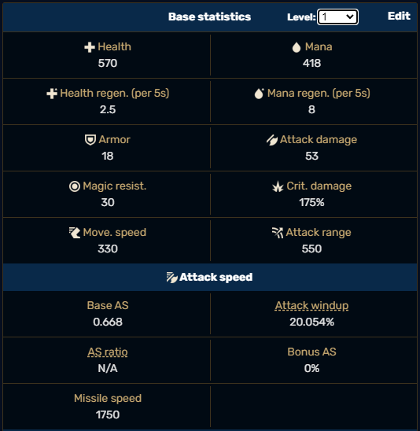
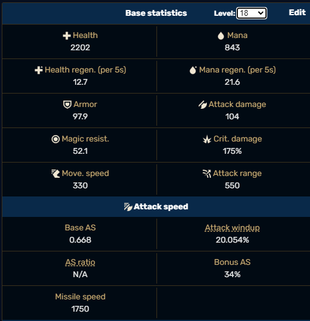
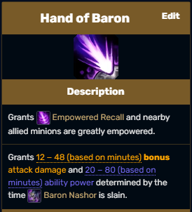

# League of Legends Damage Calculator/Optimizer

Despite the huge popularity of the game, there is a notorious lack of tools and resources for players who would like to test and deepen their knowledge about the game. Although the game itself provides a practice tool for players who look to test out characters capabilities, the functionality of it is limited, restricted to one character (or “champions” as there are called in game) at the time, having to use external tools such as notepad or excel to keep track of results and a lack of control of multiple variables making the theorycrafting and testing for the game inefficient and bothersome.

## The proposal

Build a web app that allows users to bypass the hassles described before by being able to manipulate key variables in order to calculate and optimize damage done by the user champion of choice. The app should, as a base requirement, allow the user to pick a champion, choose its equipment and a target using an intuitive user interface and the app should return the damage calculations for said situation. For said purpose, we will take inspiration from optimization tools for other games that exist on the web (links to them at the end of the document). Further requirements beyond the base functionality as a calculator will include more customization regarding target stats, inclusion of more champions and items, Dragon and Baron buffs as well as runes and shards and a optimization tool for finding out the maximum damage that could be done as well as adding restrictions for said optimization so the results can be more relatable to actual in-game situations. Although the initial version of the app planned for release will not cover every possible variable to consider when calculating output, we believe that the main value users will obtain from this app will come from the relative differences between different “item build” iterations rather than the exact value output of each; that is to say, knowing a particular build yields approximately X% output is immensely more valuable than knowing the exact number difference at the time for our users to choose their build inside the game. All the data needed for the app to work is freely provided by [Riot Games](https://developer.riotgames.com/docs/lol) which regularly updates its Data Dragon package with all the data and assets needed for the development of the product as well as manually extracted data from the game itself and its wiki page.

## The targeted market

This software is mainly aimed at players with a relatively high level of understanding of the game and would like to refine and keep updating their knowledge in order to get better results in an ever-changing game.

### Understanding what we will be calculating

League of Legends is a Multiplayer Online Battle Arena (MOBA) in which two teams of five players battle for resources in the arena in order to spend those resources on equipment for their characters in order to become stronger and defeat the enemy team by destroying their base. How much damage a champion can do is a core aspect of the game due to its player vs player nature and, although there is quite a bit of nuisance to the act of “dealing damage” in game beyond just looking at the numbers and damage formulas, we believe that looking at the numbers specially will give players a solid base from which each user own knowledge will allow them to draw further conclusion for themselves as individuals in each of their games. By this we recognize that we are not trying to “solve” the act of “dealing damage” in the game but provide a solid foundation for experienced players to draw their own conclusions and share them with the community.

### Defining “dealing damage”.

As we can see from this 2014 little comparison study, there are quite a significant amount of variables to consider. In this study, the focus is in comparing the DPS (Damage per second) of one specific champion maintaining all variables constant except one item in both case scenarios and approximating a “time to kill” target as a comparison value. This approach mainly comes short when considering the fact that DPS, and therefore “time to kill” can be misleading values. This happens due to the different playstyle available among the cast of over 160 characters in the game. While some champions are primarily focused on dealing high amounts of constant damage over time, some others are designed to deal a lot of damage in a very short time window and retreat, when considering this, choosing a time frame for which to calculate DPS for each champion would be unrealistic and could lead to some champions looking more powerful than others when in a real case scenario they are just different. As for the “time to kill” variable, we encounter a similar problem, with the variable being mostly related to the attacked target and different champions and items designed to deal more damage to more or less resistant targets. Due to these reasons, we as a team decided to focus on plain damage output for champions in the app. We believe this will provide the most unbiased result and leave the interpretation of the results to the users which should be familiar with game-specific matters such as the ones mentioned before. 

As for now we will start bby introducing the different variables to consider for our calculator to properly work.

Each champion in game has a set of base statistics, some of which increase passively during the games as the champions level up. This set of stats are called the champion “base stats''. Let's look at an example for one of League of Legends more iconic champions Ahri:

{ width=60% height=60% }

The table represents the stats of Ahri from level 1 to level 18 (max level in any given game). Most stats are self-explanatory but here is a little summary for the ones that may be not as intuitive and are relevant to the project. Mana is a resource used by most champions to cast their abilities, if the ability requires 100 mana but the champion currently has 50 mana then you can not cast said ability. Health and Mana regen are how much health or mana the champion regenerates over a 5 second period. Attack Damage (AD for short) basically refers to how much physical damage your champion can do while Ability Points (AP for short) basically refers to how much magic damage the champion can do (Base AP for every champion in the game is 0 hence why it is not in the last chart). Armor and Magic Resist (MR) indicate how much the champion resists either physical or magical damage, the more armor or MR, the less damage you take. Finally, we have Base AS, or attack speed, which refers to how fast a champion can deal basic attacks damage, the units are attacks/second.

Champions have mainly two ways of dealing damage, basic attacks or auto-attacks (AA for short) which are mainly physical damage and abilities or spells which can be either physical or magical. The amount of damage any AA or ability deals depends on the stats of the champion doing the attack and the stats of the champion receiving said attack. Let’s look at the following example, let’s say we have a level 1 Ahri (53 base attack damage) doing a basic attack into another enemy champion who for this scenario has 0 armor, hence 0% physical damage reduction. Since Ahri´s basic attack depends 100% on her attack damage and the enemy target has no physical damage reduction, the target is expected to take exactly 53 physical damage. Being able to simulate this type of scenario is the main goal of the app. Now when the equipment gets involved, most of the equipment (commonly referred to as Items) give stats to champions that possess them. Let's give the Ahri from our previous example the following item:

{ width=40% height=40% }

And let’s say our enemy target now has 100 armor which equates to 50% physical damage reduction. As you can see our level 1 Ahri with a long sword now has a total of 63 total AD (53 base AD from itself + 10 AD from the long sword). If Ahri were to basic attack our now armor equipped target, the damage dealt will be: Total damage from source _ Target’s Damage reduction = 63 _ 0.5 = 31.5 damage.

Each champion will have different damage formulas involving different stats for each of their abilities and their respective auto attack, but I hope this simple example helps you understand the topic a bit better.

For further information regarding damage calculations,I recommend the following link: https://leagueoflegends.fandom.com/wiki/Damage, mainly the sections Damage type classifications and Calculating Damage.

### Understanding abilities, pre and post mitigation damage.

Every champion in the game has two main ways of dealing damage, one is by basic attacks which we covered in the previous example and the other one being abilities. Besides some exceptions, most champions in the game have 1 passive ability, 3 basic abilities (usually referred to as their Q, W and E abilities) and one ultimate ability (usually referred to as R) Although there is a wide variety of abilities in the game, furthermore their properties which dictate how the abilities behave in game, we will only be concerned with the calculation of the total damage the ability deals if a target is hit. For this purpose, we will only care about the type of damage the ability deals (physical, magical or true damage), the abilities base damage (innate damage of the ability regardless of champion stats) and their scaling factors (which champion stats increase the damage of the ability). Here are some examples:

{ width=95% height=95% }

The ability above called “Charm” belongs to Ahri, we will only be focusing on the damage part of the ability for now. As we can see from its description, the ability deals 80/ 110/ 140/ 170/ 200 (+ 60% AP). The numbers in white are the abilities “base damage”, this damage solely depends on the level of the ability which goes from 1 to 5. Adding to the base damage, the ability also deals more damage equal to 60% of the champion AP value; we say that the ability “scales” off AP (Whenever an ability increases its damage due to some factor, we say the ability scales of said factor, it could be champion level, ability level or most stats). Lastly we can see that the ability deals magic damage, this means that we need to take the MR (magic resistance) value of the target when calculating final damage dealt by

the ability. Now to make things clear with an example, let's say Ahri has it´s “Charm” ability at level 3 (140 base damage) and has 100AP. The total damage of the ability will be 140 + 60 = 200 magic damage. Now, Ahri's charm will rarely actually deal 200 damage due to most champions having at least some MR, let’s give our charmed target 100 MR, this equates to 50% a magic damage reduction multiplier (Damage multiplier formula in figure 4 below). This would mean that if Ahri’s charm were to hit our target, its 200 magic damage Charm would only deal 100 magic damage to the target. To differentiate these instances of damage we call “Pre-mitigation damage” to the total damage of the ability from to its base damage plus scaling factors and “Post-mitigation damage” to the actual damage dealt to the target that comes from the following expression:

{ width=95% height=95% }

Pre and Post mitigation damage are always the same when talking about true damage, but that is not the case for physical and magic damage with a curious case being that the post mitigation damage could technically be higher than the pre mitigation damage given the proper conditions due to the nature of the formula.

### Abilities examples

To give a bit further insight on how different abilities work we will show some extra examples skipping the damage calculation. For simplicity we will always assume the target has 0 armor and magic resist values meaning pre and post mitigation damage are the same.

{ width=95% height=95% }

Ahri's Orb of deception is a mixed damage ability that scales off AP, as we can read from the description the orb deals two instances of damage, the first one being magical damage and the second one being true damage.

{ width=95% height=95% }

Akali´s Five Point Strike is a magical damage ability that scales off both her total AD and AP.

{ width=95% height=95% }

Scaling of abilities is not limited to just AD or AP as we can see, Shen´s Shadow Dash is physical damage ability that scales of Shen´s Bonus HP .The word “bonus” meaning it takes into consideration HP gained from external sources such as items and not Shen´s base HP value, that is to say that if Shen has 1100HP but 1000 comes from his base HP stats and only 100 from external sources, the ability will deal a bonus 100*0.15= 15 damage only and not 1100*0.15 = 165 damage.

{ width=95% height=95% }

Vayne’s Silver Bolts are a curious case of a true damage ability that scales off the ability level and the target's maximum HP completely disregarding Vayne’s stats. Complementing from the previous example, were Vayne to hit Shen, regardless of Shen current HP, the damage will be calculated based on Shen’s 1100 max HP value.

{ width=95% height=95% }

Lastly we can see an example of a non damaging ability. Janna’s Eye of the Storm is an ability that when casted into an ally it will give them a shield that scales of Janna’s AP value. In these cases we would logically only calculate the amount of shielding or healing given by the ability. (There are items that directly increase shielding and healing values ).

### Variables to consider.

In this following section, we are going to talk specifically about all the possible variables that may influence the damage calculation, starting from the most basic variables which we consider fundamental to be considered by our calculator, to the most complex or niche variables which may affect the outcome of the calculator but either their influence is barely substantial enough to justify the amount of resources needed to take them into consideration or their presence in a real game is unpredictable or unreliable enough to make them an estable variable in our calculations.

### Champion Base stats and levels

The most basic and obvious variables to take into consideration when calculating the damage output of any ability or basic attack are the attacking and attacked champion stats. As mentioned before, every champion has a set of statistics (health, attack damage, armor, magic resistance, etc) which are inherent to the champion and are mainly only altered by a champion leveling up during the match; these statistics are usually referred to as the champion **base stats**. As you can see in the images below, a champion starts with some set of stats at level 1 and they increase as the champion levels up to level 18.

{ width=50% height=50% }

{ width=50% height=50% }

Although all champions have relatively similar values, individual values for each champion should be considered in order to maintain accuracy regarding results. As a minimum requirement, the app should be able to let users choose their champion at their desired level while manually altering those of the target since they will also be required to calculate post-mitigation damage (see previous section to understand pre and post mitigation damage ). If time and resources allow it, the app should eventually let the user choose the attacked champion and their level as well in order for the result of the calculator to be more easily relatable to real in-game situations, although the priority on this point is rather low.

### Ability Ranks

Another important variable when calculating the output of an ability is its current rank. Ability ranks work as follows: Whenever a champion levels up in a game, the player can choose to rank up an ability. Basic abilities (Q, W and E) can usually rank up from rank 1 to 5 while the ultimate ability only has 3 ranks. A player can only rank up their ultimate ability to Rank 1 from champion level 6 onward, Rank 2 from champion level 11 onwards and Rank 3 from

champion level 16 onwards and finally no ability can be at a rank higher than the champion current level divided by 2 and rounded up. That is to say for example, given a champion level 8, even though they could have ranked up their abilities 8 times, no basic ability could be at rank 5 since half the champion level rounded up is 4. Any champion has to be at least level 9 to rank up any ability to rank 5. These ability ranks are important since, as we have seen in the “Understanding abilities, pre and post mitigation damage - Abilities examples” section, ability ranks usually alter how much base damage an ability deals as well as in some cases even alter the scaling factors. We believe that the ability for the user to select ability rank ups should be included in the MVP. Some sort of protection should be implemented to deny the user from ranking up abilities in a way it would be impossible inside a real game (for example having all abilities at max rank when the champion is level 6), although the app main objective is give players a tool for them to analyze and interpret the results, we should, when possible, reduce the chance for errors in order to give more accurate results.

### Items and effects

The last of the fundamental variables in our app and probably the most important. During any match, players are able to buy items from a shop inside the game using in-game resources. These items, once bought, are equipped to your champion and a max of 6 items can be equipped at any given time. Items provide champions different benefits when equipped, these benefits (commonly referred to as **buffs**) can be the following

- Stat buffs: Improve champion statistics (health, attack damage, ability power, etc), most items in the game give some form of stat buff.
- Passive effects: Are constantly active while the champion has the item equipped.
- Auras: Are buffs or debuffs that affect nearby friendly or enemy units respectively but do not affect the holder of the aura item.
- Active effects: Function similarly to champion abilities and we do not concern ourselves with them since their effect is usually rather simple and can be easily predicted without the need of a calculator.

Items are also classified in “quality tiers” increasingly as follows:

- Starter: Items intended to be effective during the beginning of the game and do not usually build into higher-tier items.
- Basic: These items provide a single stat attribute or special effect.
- Epic: Provide additional stats and/or effects with effects usually being lesser versions of the legendary item they build into.
- Legendary: Provide the greatest stat and a significant special effect. They do not build into any higher-tier items
- Mythic: Same as legendary items but they additionally provide bonus stats for every other legendary item in the inventory. Only one mythic item can be equipped at any time.

Some items possess the “unique” attribute which means only one item that shares the same “unique” attribute can be present in the build. Let's look at the following example to make things more clear:

{ width=40% height=40% }

{ width=60% height=60% }

As we can see, the item Lord Dominik’s Regards (LDR for short) provides 3 stats when equipped by any champion: +30AD, +20% critical strike chances and 30% armor penetration and also gives a unique effect called Giant Slayer. This unique effect, in addition to doing exactly what it reads, is what limits the item for it to be only able to have one copy of it at any given time. Furthermore we can see that the item has another limitation being that its unique effect belongs to a group called Last Whisper, this means that any champion is limited to only having one item from said group at any given time. Regarding these limitations, while most players from our target market should know about them, actually implementing them in the app would be a wise decision in order to avoid users getting unreplicable results, although there could be some value in allowing the possibility for further theorycrafting (Theorycrafting refers to the act of mathematically analyzing game mechanics, usually video games, in order to discover optimal tactics or strategies).

### Dragons and Baron buffs

In the current version of League of Legends, there are currently 1 Baron buff and 6 Dragon buffs listed in the table below.

{ width=70% height=70%}

{ width=40% height=40% }

Although these buffs can be obtained in a game and they affect all the champions in one team either for a fixed duration or until the match is over we will not concern ourselves with the effects of said buffs in our damage calculator. There are two main reasons for this decision, first being that most of these buffs do not affect the damage output of most champions and in the case they do (like Infernal Might or Hand of Baron), they do in a straightforward manner of just flat out increasing the damage. Although we do concern ourselves with precision regarding the output of the damage calculator, as we have stated before, the main value we expect users will get from using this app will come from looking at the relative differences between different build interactions for any given champion rather than the exact numbers. The second and last reason we choose to ignore this game mechanic regarding our app is due to the fact that “Dragon buffs” are randomly selected every game and there is no way for any player to know which Dragon buffs will be available in their upcoming matches. Due to these two reasons, we see very little value in implementing this feature into the app.

### Runes and Shards

Lastly we have Runes and Masteries. Runes are a set of passives, similar to item passives but comparatively weaker, that any player has to choose before they start a match. Skipping the details of how they are chosen, this game mechanic has similar issues to that of Dragon and Baron buffs regarding our calculator. The main reason being that most of the runes do not influence damage output whatsoever and those that do, they either do a champion independent damage of their own, increase champion stats by minimal amounts (less than even basic items) or amplify a champion´s damage output by really small amounts. In regards to Shards, they are simply a small amount of extra stats to the champion as seen in the chart below.

{ width=90% height=90% }

We understand that by not implementing these systems into the calculator we will be dealing with some margin of error when calculating the damage output of any champion ability or basic attack. However we consider this margin small enough for its omission to still deliver a product which can provide meaningful data to players in order to make better decisions when building their characters. We do not close the door to their later implementation either by our team or any other interested party once the calculator's first viable version is released.

### Extra information

Some extra links that could be helpful:

· [BoRK or BT? An analysis for Vayne Players in League of Legends by Chuqiao Huang, Journal of interdiciplanry Science Topics Volume 3 2014, University of Leicester](https://books.google.cl/books?hl=es&lr=&id=FnUhBwAAQBAJ&oi=fnd&pg=PA30&dq=league+of+legends+Damage&ots=IOMIYee5M4&sig=licJ1NXRPn5GCgpllBpqHbuGXZg&redir_esc=y#v=onepage&q&f=false)

Optimizers and calculators for reference:

· [Genshin impact optimizer/calculator with tutorials](https://frzyc.github.io/genshin-optimizer)

· [World of warcraft optimizer](https://www.raidbots.com/simbot)

· [Quick video explaining damage types in league](https://www.youtube.com/watch?v=ptxlodDl9Gw)

· [League of legends Wikipedia](https://leagueoflegends.fandom.com/wiki/League_of_Legends_Wiki)

· [League of legends documentation for developers](https://developer.riotgames.com/docs/lol)
