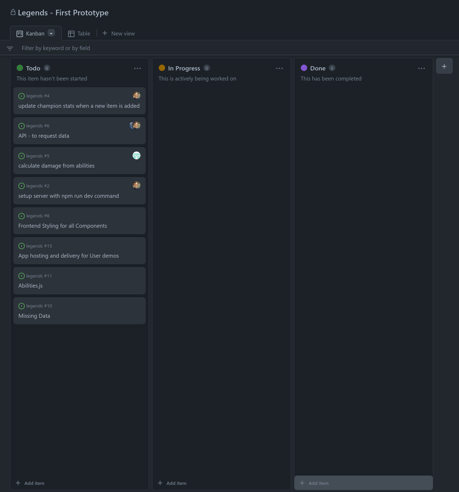
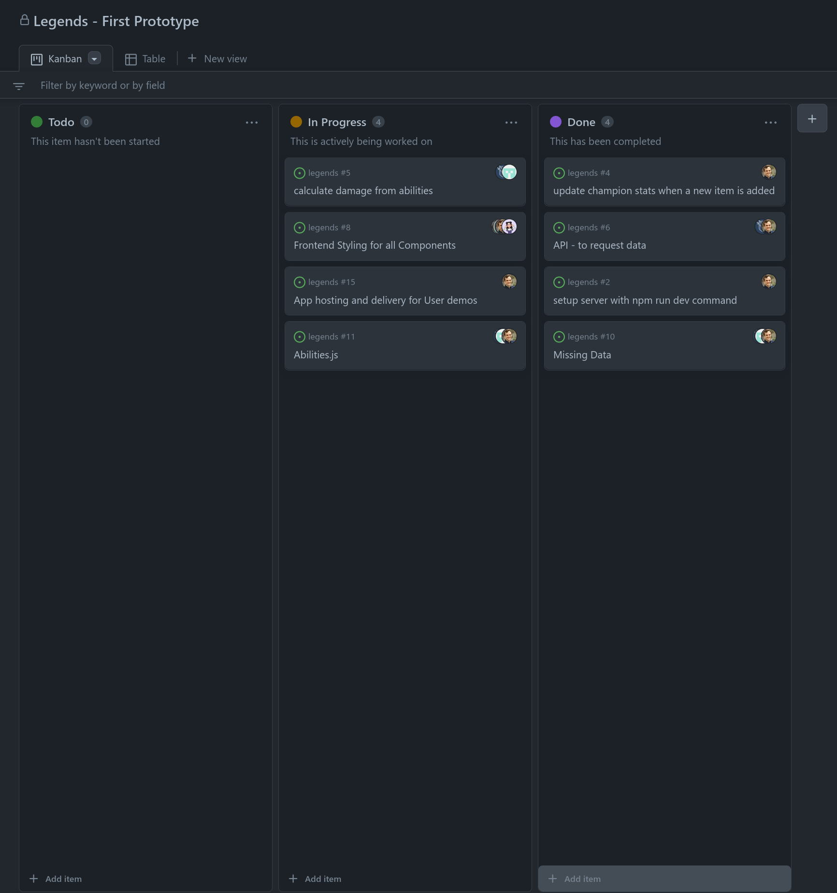
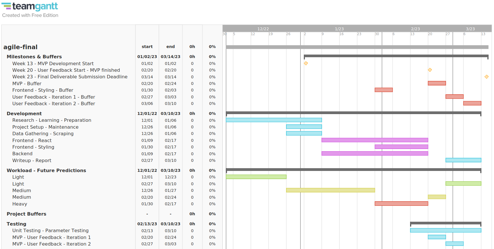
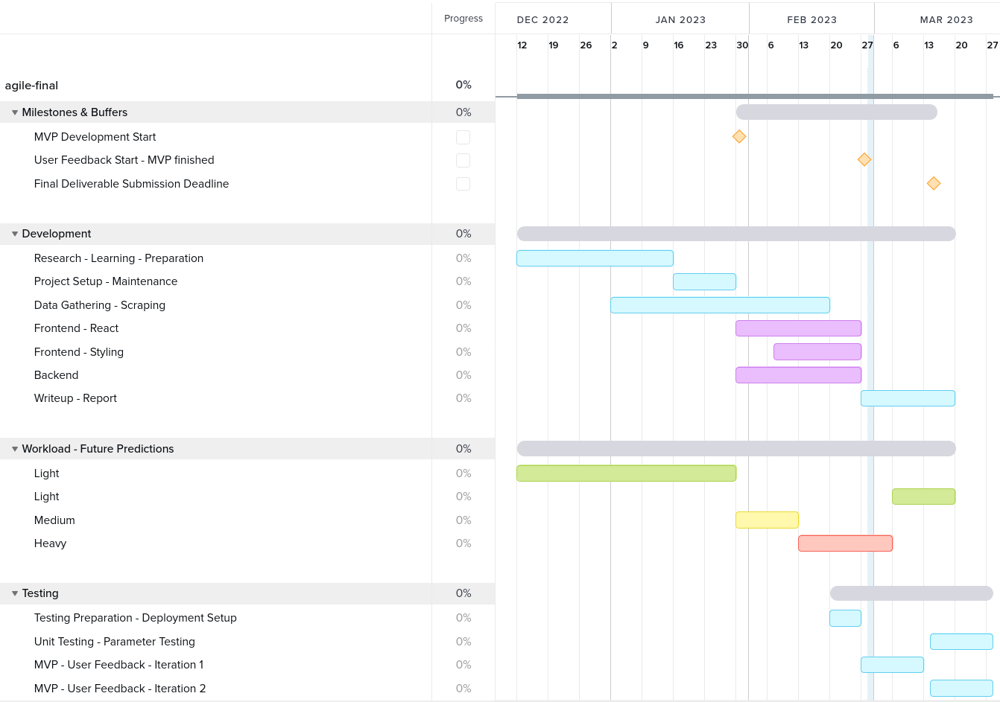

# Project Planning

During week 10 - 12, our team:
- decided what changes we wanted to make to our workflow that we had implemented throughout weeks 1 - 10.

- created a new git repository to hold all the source code for both the client and the server. This decision was made because there was going to be work that required changes to both the server and client at once, and our team can visually see these changes in the same commit. Also, setup with the frontend library the project used (React) was easier.

- created a new github project (kanban board) to organise and track the work.

- decided, and researched into the tools and libraries to create the project.

## Team Breakdown

Our team consists of 5 people and was separated based on our strengths, and the areas of value each team member could bring to the project.
1 team member was responsible for keeping task management up to date, and any tasks related to the React library used on the frontend.

2 team members were responsible for the frontend styling and obtaining user feedback.

1 team member had experience with the subject topic, performed reviews of the code and data that related to the game, worked on the frontend and backend, and obtaining user feedback.

1 team member worked on the backend, API, and damage calculations.

The isolation of tasks based on each team member's experiences and strengths saved time during the project's development, as some tasks could be completed based on prior experience and knowledge, without gathering it beforehand.

## Project Management Tools

Our team used multiple tools to ease the project's development.

**Git**

Git is a distributed version control system that tracks changes in any set of computer files, usually used for coordinating work among programmers collaboratively developing source code during software development.^[1]

Git has been the most valuable tool for our team. It was used to contribute to the same source code, and ensure files shared between contributors were kept in sync.

Any changes that required review from another team member, such as edits to another contributor's work, was either commit to a different branch than the master branch, or submitted as a PR to the master branch. This allowed time for others to review the change before it was merged.

All other changes were commited to the master branch. Our team found this simple workflow effective as the state of the application's release version was not necessary. After the application's release, our team planned to consider workflows such as GitFlow or master/develop/hotfix branches to develop the application.

Our team kept all the application's source code within a single repository as the codebase was small, and provided better integration with Github's Project Management features. As the code was not separated into different repositories, all issues on Github were in the same place. Edits to both backend and frontend parts of the codebase could be contained within a single commit, and all work to the project were kept under a single log / history.

**Slack**

Slack is an instant messaging program. Users can communicate with voice calls, video calls, text messaging, media, and files in private chats or as part of communities called workspaces.^[2]

Slack provided tools and options for our team to communicate effectively, For example, if a team member wanted to reach out, the other team member had the option to be alerted immediately (if they did not mute notifications) in their Desktop client. In contrast to Github, whereby the recipient reads the message whenever he visits the website.

**Zoom - Jitsi**

Zoom is a proprietary videotelephony software program.^[3] Jitsi is a collection of free and open-source multiplatform voice (VoIP), video conferencing and instant messaging applications for the web.^[4]

Team meetings were scheduled every week for the frontend and backend development. Some team members made both meetings every week, others only 1 meeting. This was dependant on the tasks that needed to be completed.

**Github Project Management Features - Kanban**

Our team utilised Github's Kanban board alongside their other project management features to track the progression of the application's development. It was chosen as the team was most familiar with it, and, unlike other alternatives, required no additional setup to integrate with Github and Git. 

By planning our user centered development cycles using the Kanban board, our team was able to visualise the application's progression more easily.

The Github Platform provided our team an interface for presenting our ideas and the ability for other team member's to access them.

As new tasks were realised, a new Issue under the Github repository was created with an explanation of the requiirements to complete the task. Every issue was assigned an Assignee (the team member responsible to complete the task), and a Milestone (the deadline for the task). All the issues created were added to the Github Kanban board.

Further discussion of the task to complete was done either in the issue itself, or linked to from Slack, and discussed there.

{width=60% height=60%}

{ width=60% height=60%}

Over the period of development, our team found Github was better suited for more technical discussion and this when our team used it the most to communicate. Linking to datasets, referencing commits. Keeping written communication organised and structured was more important in this case.

**Gantt Chart**

Teamgantt was used to create the Gantt Charts.
    

A Gantt chart for weeks 10-20 was created using [teamgantt](https://www.teamgantt.com/h2) to aid the development of the project. This provided a high level overview for the complete duration of the development period, as opposed to the Kanban board, which focused on specific tasks and milestones.

Our team utilised the same techniques as before, and can be found in the midterm submission sections [Iterations], [Buffers], [Workload].

The colors of the Gantt chart denote the type of task:
- Purple regions show MVP development.

- Blue regions show tasks that supported the MVP development. 

- Green/Yellow/Red show our expected workload in that week.

- Red regions in the top section show the buffer given to some tasks incase they ran behind schedule.

### Planned Gantt Projections

This Gantt Chart, created in Week 10, shows the time given to complete each part of the project.

We planned an expected workload by working back from the submission deadline. A week's buffer was added before the submission deadline to allow enough room to complete tasks running late, 2 iterations of user feedback after the MVP was finished. 2 weeks was added to the start for project setup and data gathering, with the remaining time allocated to development of the MVP.

{ width=100% height=100%}

### Gantt Chart - Actual

Here is the Gantt Chart showing the actual time allocation to tasks throughout the application's development.

{ width=100% height=100%}

As shown by the Gantt chart, our team did not start MVP development until 3 weeks after the planned date. This was due to [issues realised during the preparation of data for our application][*Making a decision to use a third party scraper after realising implementing our own was too costly*].

To compensate for the lost time, our team planned to:

- allocate more time per week to develop the MVP during the final stages of its development. 

- delay the The second iteration of user feedback, and unit tests until after the final submission.

- start work on the frontend with a test dataset. A buffer was not given for the data gathering stage because our team wanted to start frontend MVP development with a more complete dataset. For the backend, starting the work at a required time was less important, as most of the word had been done beforehand.

This could have been avoided by giving more resources to tasks that were necessary to complete before other tasks. 

MORE TODO
- fix internal links in gantt section and links to wikipedia.
- from Examplary report: why, reference, version control, atlernatives, advantages, why is it the best system, centralised/decentralised
- all blog posts, bookmarks about react app
- how we are collaborating with milestones, kanban on github. we havent used time schedule this half.

[^1] - [Wikipedia - Git](https://en.wikipedia.org/wiki/Git)
[^2] - [Wikipedia - Slack](https://en.wikipedia.org/wiki/Slack_(software))
[^3] - [Wikipedia - Zoom](https://en.wikipedia.org/wiki/Zoom_(software))

[^4] - [Wikipedia - Jitsi](https://en.wikipedia.org/wiki/Jitsi)
